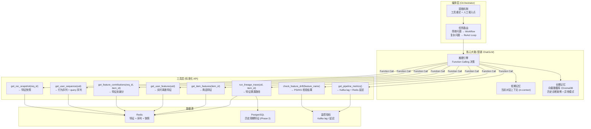

# 可解释推荐数据链路平台 — MVP 架构设计

> 基于现有 `real-time-demo` 项目改造，目标：构建支持电商场景的可解释推荐数据链路平台。
> 推荐结果可追溯至特征级别，支持通过 Agent 问答方式追溯推荐原因及数据链路异常。

---

## 一、整体架构

```mermaid
flowchart TD
    subgraph DataLayer ["数据层 (现有扩展)"]
        MockProducer["mock_producer.py\nhome / search / pdp 多场景事件"]
        Kafka_ODS["Kafka: ods_user_behavior"]
        Kafka_DWD["Kafka: dwd_behavior_with_dim"]
        Kafka_DWS_U["Kafka: dws_user_feature"]
        Kafka_DWS_I["Kafka: dws_item_feature"]
        Kafka_SEQ["Kafka: dws_user_seq_feature (新增)"]
    end

    subgraph FlinkLayer ["Flink 处理层 (Java，现有模块改造)"]
        Job1["Job1: DimJoinJob (改造)\n透传 bhv_page / bhv_ext"]
        Job2["Job2: WindowAggJob (改造)\n按 bhv_page 分流聚合"]
        Job3[\"Job3: RealtimeFeatureJob (改造)\\n特征挖掘层：窗口统计 + 交叉特征\"]\n        Job4[\"Job4: SequenceFeatureJob (新增)\\n行为补全层：5类行为序列 + 商品侧序列\"]
        Job5["Job5: IndexBuilderJob (新增)\n个性化倒排索引更新事件"]
        MonitorJob["MonitorJob (新增)\n延迟指标 + 特征分布 PSI"]
    end

    subgraph StorageLayer ["存储层"]
        Redis["Redis\n实时序列特征 + 离散特征"]
        Postgres["PostgreSQL (新增)\n离线周期特征 + 特征快照"]
        ClickHouse["ClickHouse (新增)\n排序漏斗日志 + 行为 OLAP"]
        Feast["Feast (新增)\n特征注册 + 离线实时合并 + 分布对齐"]
    end

    subgraph ServiceLayer ["服务层 (Python FastAPI，新建)"]
        RecService["recommend-service\nPOST /recommend\nPOST /recommend/inject"]
        AgentService["agent-service\nPOST /agent/chat\nGET /lineage"]
        MonitorService["monitor-service\nGET /metrics SSE\nGET /feature/drift"]
        RecModel["模型层 (可插拔)\nRuleModel -> DIN -> 可扩展"]
        ZhipuClient["智谱 ChatGLM API\nFunction Calling"]
    end

    subgraph FrontendLayer ["前端层 (新建，Vue3)"]
        Page1["页面一: Pipeline 监控面板\n实时指标折线图 + 告警"]
        Page2["页面二: 推荐 Playground\n推荐列表 + 特征贡献 + 注入行为"]
        Page3["页面三: Agent 对话\n可解释问答 + 溯源展示"]
    end

    MockProducer --> Kafka_ODS
    Kafka_ODS --> Job1
    Job1 --> Kafka_DWD
    Kafka_DWD --> Job2
    Kafka_DWD --> Job3
    Kafka_DWD --> Job4
    Kafka_DWD --> Job5
    Kafka_DWD --> MonitorJob
    Job2 --> Kafka_DWS_U
    Job3 --> Redis
    Job3 --> Kafka_DWS_U
    Job3 --> Kafka_DWS_I
    Job4 --> Kafka_SEQ
    Job5 --> Redis
    Kafka_SEQ --> Redis
    MonitorJob --> MonitorService

    Redis --> Feast
    Postgres --> Feast
    Feast --> RecService
    RecService --> RecModel
    RecModel --> RecService
    RecService --> AgentService
    RecService --> ClickHouse
    AgentService --> ZhipuClient
    AgentService --> ClickHouse

    RecService --> Page2
    AgentService --> Page3
    MonitorService --> Page1
```

---

## 二、日志格式重新设计

### 2.1 新公共字段结构

现有 `UserBehavior.java` 字段不能满足多页面场景需求，需按规范重构为统一日志格式：

```json
{
  "uid": "U000001",
  "logid": "log_550e8400e29b",
  "bhv_id": "2001",
  "bhv_type": "show",
  "bhv_page": "home",
  "bhv_src" = "direct", 
  "bhv_value" = null
  "ts":       1720000000000,
  "bhv_ext": {
    "req_id": "req_abc12345",
    "items": [
      {"item_id": "I0000123", "position": 1},
      {"item_id": "I0000456", "position": 2},
      {"item_id": "I0000789", "position": 3}
    ]
  }
}
```

### 2.2 8个事件的 关键字段 差异

| 事件 | 关键字段: bhv_id,bhv_page,bhv_type,bhv_src,bhv_value,bhv_ext
|------|-----------------
| `主页曝光` | `bhv_id = '1001', bhv_page = 'home', bhv_type = 'show', bhv_src = 'direct', bhv_value = null, bhv_ext = {"req_id":   "req_abc", "items": [ {"item_id": "I0000123", "position": 1}, {"item_id": "I0000456", "position": 2}, {"item_id": "I0000789", "position": 3}]}` 
| `搜索页曝光` | `bhv_id = '1001', bhv_page = 'search', bhv_type = 'show', bhv_src = 'direct', bhv_value = null,  bhv_ext = { "req_id":   "req_abc12345", "query":  "耐克跑鞋","items": [ {"item_id": "I0000123", "position": 1}, {"item_id": "I0000456", "position": 2}, {"item_id": "I0000789", "position": 3}]}` 
| `搜索页点击` | `bhv_id = '2001', bhv_page = 'search', bhv_type = 'click', bhv_src = 'direct', bhv_value = null, bhv_ext:= {"req_id":   "req_abc12345", "query":  "耐克跑鞋", "position": 2, "item_id":  "I0000456"}` 
| `商品详情页浏览` | `bhv_id = '2001', bhv_page = 'search', bhv_type = 'click', bhv_src = 'direct', bhv_value = null, bhv_ext = {"item_id": "I0000456","req_id":  "req_abc12345"}` 
| `商品详情页收藏` | `bhv_id = '3001', bhv_page = 'pdb', bhv_type = 'click', bhv_src = 取透传值, bhv_value = 'fav',bhv_ext = {"item_id": "I0000456","req_id":  "req_abc12345"}` 
| `商品详情页加购` | `bhv_id = '3001', bhv_page = 'pdb', bhv_type = 'click', bhv_src = 取透传值, bhv_value = 'cart',bhv_ext = {"item_id": "I0000456","req_id":  "req_abc12345"}` 
| `商品详情页购买` | `bhv_id = '3001', bhv_page = 'pdb', bhv_type = 'click', bhv_src = 取透传值, bhv_value = 'buy',bhv_ext = {"item_id": "I0000456","req_id":  "req_abc12345"}` 

### 2.3 行为类型枚举

- `bhv_type`：`show / click`
-`bhv_page`：`home / search / pdp`
- `bhv_src`：`direct / search / pdp`  
- `bhv_value`：保留 null / "" / "fav" / "cart" / "buy" 多个值兼容

### 2.4 向后兼容策略

在 `UserBehavior.java` 上使用 `@JsonIgnoreProperties(ignoreUnknown = true)`，现有 Job1/Job2/Job3 在不改动解析逻辑的情况下自动忽略新字段，不会影响现有处理链路。

---

## 三、数据链路设计

### 3.1 Kafka Topic 规划（全量）

| Topic | 层次 | 说明 | 分区 |
|-------|------|------|------|
| `ods_user_behavior` | ODS | 原始行为事件（新格式） | 3 |
| `dwd_behavior_with_dim` | DWD | 维度拼接后行为事件 | 3 |
| `dws_user_item_feature` | DWS | 用户×类目窗口聚合特征 | 3 |
| `dws_user_feature` | DWS | 用户级累计实时特征 | 3 |
| `dws_item_feature` | DWS | 商品级累计实时特征 | 3 |
| `dws_user_seq_feature` | DWS | 用户行为序列特征（新增） | 3 |
| `algo_ranking_log` | ADS | 算法漏斗各阶段物料进出日志（新增） | 3 |
| `index_update_realtime` | ADS | 实时个性化索引更新事件（新增，Phase 2） | 3 |
| `index_update_incremental` | ADS | 小时级增量索引批次（新增，Phase 2） | 3 |
| `sample_impression_home` | ADS | 主页曝光待标注流（新增，Phase 2） | 3 |
| `sample_final_home` | ADS | 主页推荐最终训练样本（含多级标签，新增，Phase 2） | 3 |

### 3.2 Redis Key 规范

```
# 实时统计特征（Job3 写入）
# 全局累计特征
feat:user:{uid}         -> Hash  { total_pv, total_click, total_buy, total_cart, total_fav,
                                   active_days, last_active_ts, user_age, user_city, user_level }
feat:item:{item_id}     -> Hash  { total_pv, total_click, total_buy, total_cart, total_fav,
                                   conversion_rate, uv, item_brand, item_price, item_title, category_id }
                                   # item_title / item_price / item_brand 由 init_dim_data.py 初始化写入，
                                   # 与实时统计特征存于同一 Hash，feature_fetcher.py 单次 HGETALL 同时取得
                                   # 特征数据（供模型打分）和展示数据（供前端渲染），无需额外查询
# 窗口统计特征（Job3 新增，滑动窗口基于 TTL State）
feat:user:stat:{uid}    -> Hash  { click_5min, click_1h, pv_5min, pv_1h,
                                   cat_click_5min:{cat_id}, cat_click_1h:{cat_id} }
feat:item:stat:{item_id}-> Hash  { pv_5min, click_5min, pv_1h, click_1h }

# 用户行为序列（Job4 写入，行为补全层 — 按行为类型分 key）
seq:pv:{uid}            -> ZSet  (score=ts, member=item_id, 最近 50 条, TTL 7d)
seq:click:{uid}         -> ZSet  (score=ts, member=item_id, 最近 50 条, TTL 7d)
seq:fav:{uid}           -> ZSet  (score=ts, member=item_id, 最近 30 条, TTL 7d)
seq:cart:{uid}          -> ZSet  (score=ts, member=item_id, 最近 30 条, TTL 7d)
seq:buy:{uid}           -> ZSet  (score=ts, member=item_id, 最近 20 条, TTL 30d)
seq:query:{uid}         -> List  (最近 20 条 query 原始字符串，LPUSH + LTRIM, TTL 7d)
                                   # 存原始字符串（如 "耐克跑鞋 男款"），不做 ID 化
                                   # MVP：feature_fetcher 取最近 3 条做关键词字符串匹配
                                   # Phase 2：推理时对 query 分词 + 向量化，进 DIN query-item attention

# 商品行为序列（Job4 写入，商品侧行为补全）
seq:item_pv:{item_id}   -> ZSet  (score=ts, member=uid, 最近 200 条, TTL 2h)
seq:item_click:{item_id}-> ZSet  (score=ts, member=uid, 最近 100 条, TTL 2h)

# 用户×商品交叉特征（Job3 CrossFeatureFunction 写入）
cross:{uid}:{category_id} -> Hash  { click_cnt, buy_cnt, cart_cnt, pv_cnt, last_ts }, TTL 30d
cross:{uid}:{brand}        -> Hash  { click_cnt, buy_cnt, last_ts }, TTL 30d

# 特征快照（推荐时写入，用于溯源）
snapshot:rec:{req_id}   -> Hash  { user_features_json, candidates_json, scores_json, ts }

# 增量训练 NIO 标记（Phase 2）
trained_req_ids         -> Set   { req_id, ... }（已参与训练的请求 ID，TTL 30d）

# 召回索引（倒排，IndexBuilderJob/Service 写入，Phase 2）
idx:user_bhv:{uid}               -> ZSet  (score=相关度, member=item_id，保留 Top 500，TTL 7d)
idx:user_pref:{uid}:{category_id} -> ZSet  (score=偏好强度, member=item_id，保留 Top 200，TTL 1d)
idx:brand:{brand}                -> ZSet  (score=近1小时点击量, member=item_id，TTL 2h)
idx:hot:{category_id}            -> ZSet  (score=近1小时热度分, member=item_id，TTL 2h)
idx:new_item:{date}              -> ZSet  (score=上架时间戳, member=item_id，TTL 7d)
```

### 3.3 Flink Job 职责分工

```
Job1 DimJoinJob         : ODS → DWD（AsyncIO Redis 维度拼接，透传新字段）
Job2 WindowAggJob       : DWD → dws_user_item_feature（1分钟滚动窗口，按页面分流）

Job3 RealtimeFeatureJob : DWD → Redis/dws_user_feature/dws_item_feature（特征挖掘层）
  └── UserFeatureFunction    : 全局累计计数（total_pv/click/buy/cart/fav）+ 活跃天数
  └── ItemFeatureFunction    : 全局累计计数（pv/click/buy/cart/fav）+ UV + 转化率
  └── WindowStatFunction     : 近5min/1h 窗口统计（用户/商品维度，TTL State 实现滑动窗口）
  └── CrossFeatureFunction   : 用户×品类、用户×品牌 交叉计数 → cross:{uid}:{cat/brand}（新增）

Job4 SequenceFeatureJob : DWD → Redis（行为补全层，新增）
  └── 用户侧：pv/click/fav/cart/buy 五类行为序列 → seq:{bhv_type}:{uid}（ZSet，分行为类型）
  └── 搜索意图：bhv_page=search 时写 seq:query:{uid}（List）
  └── 商品侧：seq:item_pv/{item_click}:{item_id}（ZSet，商品被浏览/点击的 uid 序列）

Job5 IndexBuilderJob    : DWD → Kafka index_update_realtime（个性化倒排索引更新事件，新增，Phase 2）
SampleJoinJob           : DWD → sample_final_home（主页推荐两阶段窗口 Join 样本拼接，新增，Phase 2）
MonitorJob              : DWD → 监控指标流（延迟、PSI，新增，Phase 2）
RankingLogJob           : algo_ranking_log → ClickHouse ranking_trace（新增，Phase 2）
```

### 3.4 实时特征分层设计（参考京东方案）

参考京东实时特征体系，将特征计算分为两层，由 Job3 和 Job4 分别承担：

```
┌─────────────────────────────────────────────────────────────────┐
│  行为补全层（Job4 SequenceFeatureJob）                           │
│                                                                   │
│  输入：dwd_behavior_with_dim（全量行为事件）                      │
│  职责：按行为类型分类维护序列 list，不做聚合计算                  │
│                                                                   │
│  用户侧：                                                         │
│    seq:pv:{uid}    → 浏览商品 ZSet（近50条）                      │
│    seq:click:{uid} → 点击商品 ZSet（近50条）                      │
│    seq:fav:{uid}   → 收藏商品 ZSet（近30条）                      │
│    seq:cart:{uid}  → 加购商品 ZSet（近30条）                      │
│    seq:buy:{uid}   → 购买商品 ZSet（近20条）                      │
│    seq:query:{uid} → 搜索 query List（近20条，bhv_page=search）   │
│                                                                   │
│  商品侧：                                                         │
│    seq:item_pv:{item_id}    → 近期浏览该商品的 uid ZSet（近200条）│
│    seq:item_click:{item_id} → 近期点击该商品的 uid ZSet（近100条）│
└─────────────────────────────────────────────────────────────────┘

┌─────────────────────────────────────────────────────────────────┐
│  特征挖掘层（Job3 RealtimeFeatureJob）                           │
│                                                                   │
│  输入：dwd_behavior_with_dim（全量行为事件）                      │
│  职责：在原始事件上聚合计算统计特征，不保留原始序列               │
│                                                                   │
│  用户统计特征：                                                   │
│    feat:user:{uid} → 全局累计：total_pv/click/buy/cart/fav       │
│    feat:user:stat:{uid} → 窗口统计：                             │
│      click_5min, click_1h（近N分钟/近1小时点击量）               │
│      pv_5min, pv_1h                                              │
│      cat_click_5min:{cat_id}（近5min对某品类点击量）             │
│                                                                   │
│  商品统计特征：                                                   │
│    feat:item:{item_id} → 全局累计：total_pv/click/buy + UV + 转化率 │
│    feat:item:stat:{item_id} → 窗口统计：                         │
│      pv_5min, click_5min, pv_1h, click_1h                       │
│                                                                   │
│  用户×商品交叉特征（CrossFeatureFunction 新增）：                 │
│    cross:{uid}:{category_id} → 用户对该品类的历史交互强度        │
│      { click_cnt, buy_cnt, cart_cnt, pv_cnt, last_ts }           │
│    cross:{uid}:{brand}       → 用户对该品牌的历史交互强度        │
│      { click_cnt, buy_cnt, last_ts }                             │
└─────────────────────────────────────────────────────────────────┘
```

**两层分工的核心原则**：

| 维度 | 行为补全层（Job4） | 特征挖掘层（Job3） |
|------|-------------------|-------------------|
| 粒度 | 保留原始事件序列（item_id + ts） | 聚合统计值（计数/均值） |
| 用途 | DIN Attention 序列输入（推理时采样） | 离散特征直接输入 MLP |
| 存储 | ZSet/List（有序，支持按 score 截取） | Hash（无序，O(1) 读写） |
| TTL | 7~30 天（保留历史行为供采样） | 行 Hash 无 TTL，窗口统计 TTL 与窗口等长 |

**窗口统计的实现方式（TTL State，不用 Flink 窗口算子）**：

```java
// Job3 WindowStatFunction 核心思路：
// 使用 MapState<Long, Long>（key=分钟桶时间戳，value=事件计数）
// 每次事件到来：写入当前分钟桶，清除 5min 前的过期桶
// 读取时求和 5min 内所有桶 → click_5min
// 优势：无需等待窗口触发，每条事件后即可输出最新统计值（流式更新）
```

### 3.5 离线与实时特征存储选型决策

#### 实时特征：Kafka → Redis（现有链路，不变）

Flink Job3/Job4 计算后直接写 Redis，推荐服务实时读取，链路已稳定，无需引入其他组件。

#### 离线/周期特征：PostgreSQL（Phase 2），不引入 Hudi/Iceberg

**背景**：快手、字节等大厂的离线特征落 Hudi（存储在 HDFS），原因是：
- 数十亿用户规模，每天 PB 级行为数据需要增量 Upsert（不重写全量分区）
- 需要 Spark 分布式训练消费，必须走 Hive 生态
- 需要时间旅行（Time Travel）回溯历史版本特征，用于离线模型评估复现

**本项目评估**：

| 维度 | 本项目 | 需要 Lakehouse 的场景 |
|------|-------|---------------------|
| 数据规模 | 1000 用户 × 5000 商品，周期特征几万行，MB 级 | 亿级用户，PB 级 |
| 训练框架 | PyTorch 单机 DIN（Phase 2） | Spark/TF 分布式训练集群 |
| Upsert 需求 | PostgreSQL 原生 `INSERT ... ON CONFLICT DO UPDATE` 完全覆盖 | PB 级分区不能全量重写，需要 Hudi MOR 格式 |
| 时间旅行需求 | `snapshot:rec:{req_id}` 已满足推荐时点特征溯源 | 需要回溯任意时间窗口的全量特征分布 |
| 额外依赖 | PostgreSQL 1 个容器 | Hudi/Iceberg 需要 HDFS/S3 + Hive Metastore + Spark，10+ 个组件 |

**结论**：PostgreSQL 完全满足本项目离线特征的存储、查询、Upsert 需求，引入 Iceberg/Hudi 是架构过度设计，与项目规模不匹配。若未来规模增长到需要 Spark 分布式训练时，可将 PostgreSQL 替换为 Hudi on S3，Feast 的抽象层可保证上层服务代码无需修改（这也是引入 Feast 的核心动机之一）。

---

## 四、推荐链路设计

### 4.1 漏斗架构（可插拔）

```
候选商品全集（5000）
    ↓  召回层 RecallModel（向量检索 / 规则过滤）→ Top 200
    ↓  粗排层 CoarseRankModel（双塔模型打分）→ Top 50
    ↓  精排层 FineRankModel（DIN / Transformer 精排）→ Top 20
    ↓  重排层 ReRankModel（多样性 / 业务规则调整）→ Top 10
    ↓  结果输出（含特征贡献）
```

### 4.2 模型可插拔接口

```python
# models/base_model.py
class BaseModel(ABC):
    @abstractmethod
    def predict(
        self,
        user_features: dict,
        candidates: List[str]
    ) -> List[ScoredItem]:
        """
        入参：用户特征字典 + 候选商品 ID 列表
        出参：含 score + feature_contributions 的有序列表
        """
```

MVP 阶段用 `RuleModel` 实现（加权规则打分），接口稳定后替换为 `DINModel`，不改上层调用代码。

### 4.3 特征贡献归因

- DIN 模型：利用 Attention 权重直接作为序列特征贡献度
- 离散特征：使用 SHAP 值（`shap` 库）或简化积分梯度计算边际贡献
- 输出格式：

```json
{
  "req_id": "req_abc12345",
  "items": [
    {
      "item_id":     "I0000123",
      "title":       "商品名称",
      "price":       "99.0",
      "category_id": 50014015,
      "score":       0.87,
      "feature_contributions": {
        "behavior_seq_attention": 0.42,
        "category_match":        0.28,
        "price_preference":      0.17,
        "user_level":            0.13
      },
      "del_reason": [
        {"param": "item", "label": "商品不感兴趣"},
        {"param": "cate", "label": "屏蔽同类商品", "value": "50014015"}
      ]
    }
  ]
}
```

字段说明：
- `req_id`：本次推荐请求唯一 ID，前端回传至行为日志 `bhv_ext.req_id`，用于曝光-点击关联
- `title`、`price`：商品展示字段，从 `feat:item:{item_id}` Hash 中与特征数据一并读取，无需额外查询
- `del_reason`：用户负反馈选项列表，`param=item` 屏蔽单品，`param=cate` 屏蔽同类，`value` 为类目 ID

### 4.4 样本构造设计

#### 实时样本拼接流程（参考京东方案）

**样本流与特征流的分离**

本项目有两类流，职责不同：

- **特征流**：Flink Job3/Job4 从 DWD 计算实时特征，输出到 Redis，供推理时读取
- **样本流**：以曝光日志为数据源，通过多阶段窗口 Join 拼接标签，生成训练样本

当前方案只有特征流，没有独立的样本拼接流，无法区分"曝光后产生点击"和"曝光后无点击"，样本质量低。Phase 2 需要建立完整的实时样本流。

**两个业务场景的样本策略**

本项目有主页推荐和搜索两个场景，但核心目标是推荐服务，搜索页的作用是**捕捉用户意图信号**：

| 维度 | 主页推荐场景 | 搜索场景 |
|------|------------|---------|
| 目标 | 训练推荐模型（样本流） | 捕捉用户意图（特征流） |
| 样本流 | 曝光 → 窗口 Join 拼标签 → 训练样本 | **不建独立样本流** |
| 数据用法 | `sample_final_home` → PostgreSQL → 训练 DIN | 搜索 query/点击 → `seq:query:{uid}` → 作为推荐模型特征输入 |

搜索行为通过 Job4 `SequenceFeatureJob` 写入 `seq:query:{uid}`（最近 20 条 query），在推理时作为用户意图特征输入推荐模型，不需要建立独立的搜索排序模型或搜索样本流。

**结论**：样本流只处理主页推荐场景，搜索行为以特征形式服务于推荐模型。

**搜索 query 的存储与处理分层**

打点层只做忠实记录，query 以原始字符串写入 Redis，意图提取在服务层分阶段完成：

```
打点层（忠实记录）
  bhv_ext.query = "耐克跑鞋 男款"   → 原始字符串，不做 ID 化

Job4 写入 Redis（直接存，不预处理）
  LPUSH seq:query:{uid} "耐克跑鞋 男款"
  LTRIM seq:query:{uid} 0 19          → 保留最近 20 条

feature_fetcher.py 推理时（意图特征提取）
  MVP 阶段：
    取最近 3 条 query 字符串，与候选 item 的 title/category 做关键词包含匹配
    → query_match 作为离散特征输入 RuleModel

  Phase 2 阶段（DIN）：
    对 query 字符串分词（jieba）→ 提取核心关键词
    → 关键词向量化（预训练词向量或微调 Embedding）→ query_emb
    → DIN 中 query_emb 与 item_emb 做 attention → query-item 相关度特征
    → 同一份 query_emb 也可与用户历史点击序列做融合，捕捉"搜索意图驱动的推荐"
```

不引入独立 query 解析服务的原因：本项目 query 量小（20 条/用户），jieba 分词在服务侧内联调用即可，无需离线预处理管道。

**实时样本拼接三阶段（Phase 2，以主页推荐为例）**

数据源只接入曝光日志（`bhv_page=home`，`bhv_type=show`），通过 `req_id` 和时间窗口逐步拼接标签：

```
Stage 1：曝光流过滤
  Kafka: dwd_behavior_with_dim
      ↓  过滤条件：bhv_page=home AND bhv_type=show
      ↓  每条曝光记录：{ req_id, uid, item_id, ts, user_features, ... }
      ↓  写入 Kafka: sample_impression_home（曝光样本待标注流）

Stage 2：曝光 × 点击流 Join（10 分钟窗口）
  sample_impression_home × dwd_behavior_with_dim(bhv_type=click)
      ↓  Join Key：req_id + item_id
      ↓  窗口：曝光发生后 10 分钟
      ├── 10分钟内有对应 click → 点击标签 label_click=1
      └── 10分钟内无对应 click → 点击标签 label_click=0（展示未点击负样本）
      ↓  输出：{ req_id, uid, item_id, label_click, ts, ... }
      ↓  写入 Kafka: sample_with_click_label

Stage 3：点击样本 × 加购/购买行为 Join（20 分钟窗口）
  sample_with_click_label(label_click=1) × dwd_behavior_with_dim(bhv_type=cart/buy, bhv_src=home)
      ↓  Join Key：uid + item_id（PDP 行为通过 bhv_src=home 确认来源于主页推荐路径）
      ↓  窗口：点击发生后 20 分钟
      ├── 20分钟内有 cart/buy → label_cart=1 / label_buy=1
      └── 20分钟内无 cart/buy → label_cart=0 / label_buy=0
      ↓  输出最终训练样本：{ req_id, uid, item_id, label_click, label_cart, label_buy, features }
      ↓  写入 Kafka: sample_final_home → 落 PostgreSQL（离线特征存储）
```

**时间窗口的灵活配置原则**：
- 主页推荐普通商品：点击窗口 10 分钟，转化窗口 20 分钟
- 高价品类（家电、数码）：转化窗口可延长至 60 分钟（用户决策周期长）
- 窗口参数通过 Flink Job 配置文件控制，不硬编码

**打点设计与拼接流程的对应关系**

M1 改造完成后（`bhv_page`、`bhv_ext`、`bhv_src` 字段落地），各拼接步骤的字段支撑：

| 拼接需求 | 依赖字段 | 来源 |
|---------|---------|------|
| 只取主页曝光 | `bhv_page=home` + `bhv_type=show` | M1 改造后 `dwd_behavior_with_dim` |
| 曝光和点击关联 | `req_id`（同一推荐请求内唯一） | 现有字段，已在 `UserBehavior.java` 中 |
| PDP 加购/购买归因到主页路径 | `bhv_page=pdp` + `bhv_src=home` | M1 改造后，PDP 行为携带来源页标记 |
| 区分搜索路径的转化 | `bhv_src=search` | M1 改造后，搜索场景转化独立处理 |

**新增 Flink Job 和 Kafka Topic（Phase 2）**：

| 组件 | 说明 |
|------|------|
| `SampleJoinJob`（新增 Flink Job） | 消费 DWD，过滤主页曝光 + 两阶段窗口 Join，生成最终训练样本 |
| `sample_impression_home` | Kafka Topic：主页曝光待标注流 |
| `sample_final_home` | Kafka Topic：主页推荐最终样本（含 label_click/cart/buy 三个标签） |

**样本存储**：`sample_final_home` → PostgreSQL `train_samples_home` 表（离线样本），同时保留近 7 天数据用于 NIO 增量训练过滤。

**多级标签的训练策略**：

| 阶段 | 使用标签 | 模型目标 | 说明 |
|------|---------|---------|------|
| MVP（RuleModel/DIN 初始版） | `label_click` 单目标 | 点击率（CTR） | 正=曝光后有点击，负=曝光后无点击，实现最简单 |
| Phase 2（DIN 完整版） | `label_click + label_cart + label_buy` 三目标 | CTR + 加购率 + 转化率联合优化 | MMOE 架构，三个 Expert + 三个 Tower，损失加权求和 |

```
Phase 2 多目标 Loss：
  Loss = w_click * BCE(pred_click, label_click)
       + w_cart  * BCE(pred_cart,  label_cart)
       + w_buy   * BCE(pred_buy,   label_buy)

  权重建议：w_click=1.0, w_cart=2.0, w_buy=4.0
  （转化稀疏，权重上调以平衡梯度）
```

---

#### PointWise 的效率问题

经典 PointWise 训练方式（每个候选 Item 独立构成一条样本）存在以下问题：

- **用户特征冗余**：同一次请求曝光了 m 个 Item，生成 m 条样本，用户侧特征（行为序列、离散特征）被重复存储 m 次，存储和计算开销是 O(m)
- **候选 Item 间无交互**：精排阶段各 Item 独立打分，模型无法感知"竞争关系"（如当前曝光集中已有同类优质商品时，该 Item 的相对得分应下降）
- **负样本质量差**：随机负采样或仅使用未点击曝光样本，导致模型对难负例学习不足

#### 粗排：Semi-PointWise 打包方案（参考美团）

粗排阶段将同一请求的 Top-K 候选打包为一条样本（Semi-PointWise），解决用户特征重复存储问题：

```
传统 PointWise（粗排）：
  req_id=req_abc, 候选 [I001, I002, I003, ..., I200]
  → 200 条样本，每条都包含完整用户特征

Semi-PointWise 打包后：
  req_id=req_abc
  → 1 条样本：{
      user_features: {...},            # 用户特征只存一份
      candidates: [I001, I002, ..., I200],  # Item 列表
      labels: [0, 0, 1, 0, ..., 0]    # 对应点击 label
    }
```

**粗排模型结构（双塔 + 轻量交互）**：
- User Tower：编码用户特征 → user_emb（一次前向传播）
- Item Tower：批量编码所有候选 Item → item_emb 矩阵（可向量化）
- 交互层：`score_i = dot(user_emb, item_emb_i)`，向量化批量计算，不引入候选间交叉（保持粗排效率）
- 训练时 loss：BPR Loss（正样本 score > 负样本 score）或 Softmax Cross-Entropy

**工程收益**：
- 存储：用户特征从写 m 次降为写 1 次
- 推理：Item Tower 可离线缓存 item_emb，召回期间增量更新
- 训练：Batch 内负样本复用（同一 batch 的其他正样本 Item 自动成为负样本）

#### 精排：ListWise 打包 + 候选间交互（参考美团 COLD/PEAR）

精排阶段引入候选 Item 间交互，进一步提升排序质量：

```
精排输入（粗排 Top-50 → 精排）：
  {
    user_features: {...},
    candidates: [I_1, I_2, ..., I_50],   # 粗排筛选后的候选集
    candidate_features: [feat_1, ..., feat_50]
  }

精排模型（DIN-based + Item Cross-Attention）：
  1. DIN Attention：target_item vs. 用户行为序列 → seq_contribution
  2. Item Cross-Attention：target_item vs. 其他候选 item → 竞争感知分数
  3. 融合输出：final_score_i = MLP(din_score_i + cross_attention_i + discrete_features)
```

**候选间交互的价值**：精排模型能感知到"该 Item 在当前曝光集合中的相对竞争力"，而不是孤立打分，与用户的实际决策过程（比较后选择）更一致。

#### 负样本策略

| 负样本类型 | 来源 | 适用阶段 | 说明 |
|-----------|------|---------|------|
| 曝光未点击 | `bhv_type=show` 且无对应 `click` | 精排 | 高质量难负例，模型已经召回但用户未选 |
| 批内负样本 | 同 batch 其他请求的正样本 Item | 粗排/召回 | 复用效率高，代表"全局流行但与该用户无关" |
| 未曝光负样本 | 全量商品随机采样（排除已曝光） | 召回 | 补充简单负例，防止模型只学习召回集内部分布 |
| 时序负样本 | 用户历史上曝光但从未交互的 Item | 精排 | 体现长期无兴趣，比单次未点击更强的负信号 |

**未曝光负样本的引入时机**：
- 召回训练阶段必须引入（召回模型的正负样本空间是全量商品，不能只用曝光集）
- 精排阶段**谨慎使用**：未曝光≠无兴趣（可能是召回层漏掉了），过多引入会引入噪声，建议比例不超过曝光未点击负样本的 20%

**在本项目中的实现位置**：
- `recommend-service/feature/sample_builder.py`（Phase 2）：负责按 `req_id` 聚合曝光集、打 label、拼接用户行为序列，生成训练样本
- 曝光未点击负样本：从 Redis `snapshot:rec:{req_id}` 取曝光 Item 列表，关联 `seq:click:{uid}` 验证是否点击
- 批内负样本：训练时在 DataLoader 层实现，不需要额外存储

#### 行为序列采样策略

用户行为序列呈幂律分布（Top 10% 用户贡献 ~60% 流量），高频用户可积累数百条历史行为。若直接固定截断，训练样本分布会偏向近期行为，丢失泛化能力；推理时若全量输入 Attention 层，高频用户延迟显著高于低频用户，分布不一致。因此两个阶段均需采样策略。

**选用策略：时间衰减加权采样（方案一）**

业界备选方案对比：

| 方案 | 原理 | 优点 | 缺点 |
|------|------|------|------|
| 时间衰减加权采样 | `w_i = e^(-λ * Δt_i)`，按权重随机抽取 L 条 | 近期行为自然获得更高概率；与 DIN Attention 互补；训练/推理复用同一逻辑 | 需要调 λ 超参 |
| Beta 分布随机截断 | 截断长度 `L ~ Beta(α, β) * (max - min) + min` | 实现简单；随机长度能力强 | 不感知行为时间，可能截入大量早期无效行为；只适合训练增强，推理不适用 |
| 保留最近 N 条 | 固定截取最新 N 条 | 实现最简单 | 完全丢弃早期行为，高频用户大量信息浪费 |
| 均匀随机采样 | 在全部历史中等概率采 L 条 | 兼顾早/近行为 | 不符合"近期行为权重更高"的业界共识 |

**时间衰减加权采样实现规范**：

```python
# recommend-service/feature/sequence_sampler.py
import numpy as np

def sample_sequence(
    seq: list[tuple[str, int]],  # [(item_id, timestamp), ...], 按 ts 降序
    target_len: int,             # 目标采样长度，推理时固定（如32），训练时可随机
    decay_lambda: float = 0.1,   # 衰减系数，越大越偏向近期
    now_ts: int = None
) -> list[str]:
    if len(seq) <= target_len:
        return [x[0] for x in seq]
    now_ts = now_ts or seq[0][1]  # 以最近行为时间为基准
    # 时间差转换为天数，计算衰减权重
    deltas = [(now_ts - ts) / 86400_000 for _, ts in seq]
    weights = np.exp(-decay_lambda * np.array(deltas))
    weights /= weights.sum()
    idx = np.random.choice(len(seq), size=target_len, replace=False, p=weights)
    # 采出后按时间降序排列（保持序列顺序语义）
    idx_sorted = sorted(idx, key=lambda i: -seq[i][1])
    return [seq[i][0] for i in idx_sorted]
```

**两阶段使用规范**：

- **推理时**（`feature_fetcher.py`）：`target_len` 固定为 32，保证推理延迟稳定，与训练分布对齐
- **训练时**（`sample_builder.py`）：`target_len` 从 `[16, 50]` 均匀随机采样（随机长度能力），同时叠加 Beta 分布截断作为**数据增强**（同一训练样本生成 2~3 个不同截断版本，扩充训练集）

```python
# 训练时序列长度的随机化（数据增强）
base_len = np.random.randint(16, 51)             # 均匀随机主长度
aug_len  = int(np.random.beta(2, 5) * 34 + 16)  # Beta(2,5) 偏短截断，生成增强样本
```

**在本项目中的模块分布**：

```
recommend-service/
├── feature/
│   ├── sequence_sampler.py    # 采样核心逻辑（推理/训练共用）
│   ├── feature_fetcher.py     # 推理时调用，target_len=32
│   └── sample_builder.py      # 训练时调用，随机 target_len + Beta 增强（Phase 2）
```

`SequenceFeatureJob.java`（Flink）负责将行为事件写入 Redis ZSet（保留最近 50 条原始记录），采样逻辑**不在 Flink 侧实现**，由 Python 服务在读取时完成，原因：
- 采样参数（λ、target_len）需要随模型版本调整，放在服务侧更易热更新
- Flink 侧保留完整的 50 条原始记录，上层可按需采样，不损失原始信息

#### New Impression Only（NIO）增量训练策略

**必要性分析**

NIO 的核心：在增量/流式训练中，只对**首次出现的曝光样本**计算 Loss，避免同一条记录随流的持续消费被多次喂给模型。

| 训练模式 | 是否需要 NIO | 原因 |
|---------|------------|------|
| 离线全量批训练 | 不需要 | 每次训练从零开始，每条样本天然只计算一次 |
| 增量/流式训练（Phase 2）| **必须引入** | 不标记已训练样本，早期高频商品的曝光会随时间持续积累梯度，模型会过拟合到历史热门分布，压制新商品的学习信号 |
| MVP 阶段 RuleModel | 不涉及 | 无梯度更新，无需考虑 |

**可行性分析**

本项目已有 `snapshot:rec:{req_id}` 存储每次推荐请求的快照，NIO 可以直接复用 Redis 标记样本训练状态，不需要新增组件：

```
增量训练时的 NIO 过滤流程：

  消费 Kafka dws_user_seq_feature（新曝光事件流）
      ↓
  检查 Redis: SISMEMBER trained_req_ids {req_id}
      ├── 已存在 → 跳过，不计入本轮 Loss（NIO 过滤）
      └── 不存在 → 构造样本，参与训练
                  训练完成后: SADD trained_req_ids {req_id}，TTL 30d
```

```python
# recommend-service/feature/sample_builder.py（Phase 2 增量训练核心逻辑）
class IncrementalSampleBuilder:
    TRAINED_SET_KEY = "trained_req_ids"

    def is_new_impression(self, req_id: str) -> bool:
        return not self.redis.sismember(self.TRAINED_SET_KEY, req_id)

    def mark_trained(self, req_ids: list[str]):
        pipe = self.redis.pipeline()
        for req_id in req_ids:
            pipe.sadd(self.TRAINED_SET_KEY, req_id)
        pipe.expire(self.TRAINED_SET_KEY, 86400 * 30)  # TTL 30天
        pipe.execute()

    def build_batch(self, events: list[dict]) -> list[TrainSample]:
        new_events = [e for e in events if self.is_new_impression(e["req_id"])]
        samples = [self._build_sample(e) for e in new_events]
        self.mark_trained([e["req_id"] for e in new_events])
        return samples
```

**增量训练频率建议**

不推荐逐事件在线学习（Online Learning），稳定性差、梯度噪声大。推荐 **小时级 Micro-batch 增量**：

```
每小时触发一次增量训练：
  Airflow 定时调度（Phase 2）
      ↓
  从 Kafka 拉取过去 1 小时新增曝光事件
      ↓
  NIO 过滤（去除 trained_req_ids 中已有的 req_id）
      ↓
  拼接用户序列 + 特征 → 构造增量样本集
      ↓
  在当前模型 checkpoint 基础上 fine-tune（少量 epoch）
      ↓
  写入新 checkpoint，更新 model_version 到 Redis
```

**NIO 在本项目中的位置**

- `recommend-service/feature/sample_builder.py`（Phase 2）：NIO 过滤 + 样本构造逻辑
- Redis Key `trained_req_ids`：Set 类型，存储已训练 `req_id`，TTL 30d
- `snapshot:rec:{req_id}`（已有）：存储推荐时特征快照，NIO 过滤时同时作为样本特征来源
- 调度入口：Airflow DAG `incremental_train_dag`（Phase 2，与 M3 离线特征存储同期实现）

---

### 4.5 ID 特征工程与语义 ID

#### 判断结论：当前规模不需要引入语义 ID

**背景**：Meta 等大厂采用前缀语义 ID（Semantic ID with Namespace Prefix）工程，将不同实体域的 ID 映射到统一 Embedding Table 但用前缀隔离命名空间：

```
"U:U000001"   → user embedding
"I:I0000001"  → item embedding
"C:23"        → category embedding
"B:Nike"      → brand embedding
```

其核心动机：解决超大规模系统（数十亿商品）中不同域 ID 数值碰撞、跨域冷启动迁移学习的问题。

**针对本项目的评估**：

| 维度 | 评估 |
|------|------|
| 数值碰撞风险 | 已不存在。`user_id="U000001"`、`item_id="I0000001"` 天然带字母前缀，不同域格式本身已隔离 |
| 跨域迁移收益 | 有限。本项目 1000 用户 + 5000 商品规模极小，各域独立 Embedding Table 完全覆盖，无需跨域迁移 |
| DIN 标准实践 | DIN 各域分别查独立 Embedding Table（user_emb、item_emb、category_emb 分离），语义 ID 是可选优化项 |
| 工程成本 | 引入语义 ID 需要统一 Tokenizer、重建 Embedding 索引，需与现有 Redis/Flink ID 格式全面对齐 |

**结论**：MVP 和 Phase 2 均不引入语义 ID，各域保持独立 Embedding Table。

#### 注意事项：category_id 裸整数的防御性设计

当前 `category_id` 以裸整数（1~50）进入模型，`brand` 以原始字符串（"Nike"、"Apple"）进入 Embedding Table。这在当前规模下没有问题，但存在一个潜在风险：

**若未来扩展时多个整数 ID 域混用同一 Embedding Table**（如 category_id、position、user_level 同时作为离散特征），不同域 ID 数值会产生碰撞（`category_id=1` 和 `position=1` 命中同一个 embedding）。

**防御性约定**（写入代码规范，无需立即重构）：

```python
# recommend-service/feature/feature_schema.py
# ID 特征进入 Embedding 前统一加命名空间前缀
def add_namespace(field_name: str, value) -> str:
    """
    category_id=23   → "C:23"
    position=3       → "P:3"
    user_level=2     → "L:2"
    brand="Nike"     → "B:Nike"
    item_id="I0000001" → 已有前缀，保持不变
    user_id="U000001"  → 已有前缀，保持不变
    """
    namespace_map = {
        "category_id": "C",
        "position":    "P",
        "user_level":  "L",
        "brand":       "B",
    }
    prefix = namespace_map.get(field_name)
    return f"{prefix}:{value}" if prefix else str(value)
```

此函数在 `feature_schema.py` 中定义，`feature_fetcher.py` 在构造模型输入时统一调用，**不影响 Flink 侧的存储格式**（Redis 里仍存原始值），只在进入 Embedding 查表前做转换。

---

### 4.6 召回索引服务设计

参考京东实践，在大规模商品场景下，召回层需要有专门的**索引构建链路**支撑，而不是每次请求全量扫描候选集。本项目商品数可模拟扩展到百万级，因此设计完整的索引体系。

#### 索引分类

| 索引类型 | 说明 | 数据来源 | 更新频率 |
|---------|------|---------|---------|
| **个性化索引 — 用户行为足迹** | `idx:user_bhv:{uid}` → 该用户历史交互商品集合 + 相似商品扩展 | 用户行为日志（click/fav/buy） | 实时（每次行为事件触发） |
| **个性化索引 — 用户偏好** | `idx:user_pref:{uid}:{category_id}` → 该用户偏好类目下的候选商品 | Job3 用户特征（top category 偏好） | 分钟级增量 |
| **基础索引 — 品牌** | `idx:brand:{brand}` → 该品牌下的商品列表（按热度排序） | 商品维度 + 行为统计 | 小时级增量 |
| **基础索引 — 时间** | `idx:new_item:{date}` → 该日期上架的新品列表 | 商品上架事件 | 实时 |
| **基础索引 — 类目热度** | `idx:hot:{category_id}` → 该类目近期热门商品 | ClickHouse 点击统计 | 小时级增量 |

所有索引以**倒排形式**存储：属性值作为 Key，对应商品列表作为 Value（ZSet，score 表示相关度/热度）。

#### 索引构建三级链路（参考京东方案）

```
┌──────────────────────────────────────────────────────────────────┐
│  Level 1：实时索引（秒级，行为触发驱动）                           │
│                                                                    │
│  用户行为事件（click/fav/buy）                                     │
│      ↓  Kafka: dwd_behavior_with_dim（已有）                       │
│      ↓  Flink IndexBuilderJob（新增）                              │
│         ├── 解析行为，提取 uid + item_id + bhv_type                │
│         ├── 补充商品属性（Redis dim:item:{id}，已有）               │
│         └── 写入 Redis 个性化索引：                                │
│             ZADD idx:user_bhv:{uid} {score} {item_id}             │
│             ZADD idx:user_pref:{uid}:{category_id} {score} {item} │
└──────────────────────────────────────────────────────────────────┘

┌──────────────────────────────────────────────────────────────────┐
│  Level 2：增量索引（分钟/小时级，基于 OLAP 正排结果）              │
│                                                                    │
│  行为数据持续写入 ClickHouse: user_behavior_olap（已有）           │
│      ↓  定时触发（每小时，Airflow 调度，Phase 2）                  │
│      ↓  ClickHouse 正排计算：                                      │
│         SELECT item_id, category_id, brand,                        │
│                count() AS click_1h, sum(buy) AS buy_1h             │
│         FROM user_behavior_olap                                    │
│         WHERE ts >= now() - INTERVAL 1 HOUR                        │
│         GROUP BY item_id, category_id, brand                       │
│      ↓  基于正排结果，触发倒排重建：                               │
│         IndexBuilderService（Python）                              │
│         ├── 写入 Redis: ZADD idx:brand:{brand} {click_1h} {item}  │
│         └── 写入 Redis: ZADD idx:hot:{category_id} {score} {item} │
└──────────────────────────────────────────────────────────────────┘

┌──────────────────────────────────────────────────────────────────┐
│  Level 3：全量索引（天级，基于全量商品维度数据）                   │
│                                                                    │
│  init_dim_data.py 全量商品数据（或模拟大规模商品）                 │
│      ↓  天级批处理脚本 build_full_index.py（Phase 2）              │
│      ↓  遍历所有商品，按品牌/类目/标签分组                         │
│      ↓  写入 Redis 基础索引（全量覆盖，ZADD + EXPIRE）             │
│         idx:brand:{brand}  → 该品牌全量商品                       │
│         idx:new_item:{date} → 当日上架新品                         │
└──────────────────────────────────────────────────────────────────┘
```

#### 索引数据在 Kafka 中的传递（对应京东方案中的中间 Topic）

实时索引构建不是直接写 Redis，而是先写 Kafka Topic，由下游 IndexBuilderJob 消费构建，解耦生产与消费：

| Topic | 说明 | 生产方 | 消费方 |
|-------|------|-------|-------|
| `index_update_realtime` | 实时个性化索引更新事件（uid + item_id + score + index_type） | Flink IndexBuilderJob | IndexBuilderService（写 Redis 索引） |
| `index_update_incremental` | 小时级增量索引更新批次（item_id + brand + category + click_1h） | Airflow 触发的 ClickHouse 计算结果 | IndexBuilderService（写 Redis 索引） |

**中间 Topic 的必要性**：与 Flink 的写 Redis 直接操作相比，Topic 解耦后，IndexBuilderService 可独立扩容、独立失败重试，不影响 Flink 主链路的稳定性。

#### 召回服务调用索引的方式

```python
# recommend-service/recall/index_recall.py
class IndexRecallService:

    def recall_by_user_behavior(self, uid: str, top_k: int = 200) -> list[str]:
        """个性化召回：从用户行为足迹索引取 Top-K"""
        return self.redis.zrevrange(f"idx:user_bhv:{uid}", 0, top_k - 1)

    def recall_by_user_preference(self, uid: str, category_id: int, top_k: int = 100) -> list[str]:
        """偏好类目召回：从用户偏好索引取 Top-K"""
        return self.redis.zrevrange(f"idx:user_pref:{uid}:{category_id}", 0, top_k - 1)

    def recall_by_brand(self, brand: str, top_k: int = 100) -> list[str]:
        """品牌召回：从品牌热度索引取 Top-K"""
        return self.redis.zrevrange(f"idx:brand:{brand}", 0, top_k - 1)

    def recall_by_hot_category(self, category_id: int, top_k: int = 100) -> list[str]:
        """热门类目召回：从类目热度索引取 Top-K"""
        return self.redis.zrevrange(f"idx:hot:{category_id}", 0, top_k - 1)

    def multi_source_recall(self, uid: str, user_features: dict) -> list[str]:
        """多路合并：各路召回结果取并集，去重后送粗排"""
        candidates = set()
        candidates.update(self.recall_by_user_behavior(uid, 100))
        top_cat = user_features.get("top_category_id")
        if top_cat:
            candidates.update(self.recall_by_user_preference(uid, top_cat, 50))
            candidates.update(self.recall_by_hot_category(top_cat, 50))
        return list(candidates)[:200]  # 截断至 Top 200 送粗排
```

**多路召回合并策略**：各路召回结果取并集后截断，保证候选集多样性（行为召回偏个性化，热度召回补充冷启动场景）。

#### 与现有漏斗架构的对接

原 Section 4.1 中「召回层 RecallModel（向量检索 / 规则过滤）→ Top 200」更新为：

```
候选商品全集（5000，可模拟扩展至百万级）
    ↓  召回层（多路索引召回，IndexRecallService）→ Top 200
       ├── 个性化召回：idx:user_bhv:{uid}（行为足迹）
       ├── 偏好类目召回：idx:user_pref:{uid}:{cat}（用户偏好）
       ├── 品牌召回：idx:brand:{brand}（用户偏好品牌）
       └── 热门类目召回：idx:hot:{category_id}（兜底）
    ↓  粗排层 CoarseRankModel（双塔模型打分）→ Top 50
    ↓  精排层 FineRankModel（DIN / Transformer 精排）→ Top 20
    ↓  重排层 ReRankModel（多样性 / 业务规则调整）→ Top 10
    ↓  结果输出（含特征贡献）
```

#### 在本项目中的文件分布

```
recommend-service/
├── recall/
│   ├── index_recall.py        # 多路索引召回服务（个性化 + 基础索引）
│   └── index_builder.py       # IndexBuilderService：消费 Kafka index_update_* → 写 Redis 索引
flink-jobs/
└── job5/IndexBuilderJob.java  # 消费 dwd_behavior_with_dim → 生产 index_update_realtime（Phase 2）
scripts/
└── build_full_index.py        # 天级全量索引重建脚本（Phase 2）
```

---

参考京东实践，解释链路分为两个正交维度：

- **排序可解释**：记录物料从召回 → 过滤 → 粗排 → 精排 → 重排各阶段的进出情况，回答「这个商品为什么出现/消失在最终结果中」
- **模型可解释**：从特征层面剖析模型对某商品得分的影响，回答「是哪些特征让它得分高/低」

两者的数据来源不同，最终都写入 ClickHouse，对外暴露语义化接口供 Agent 调用。

### 5.1 排序可解释设计

#### 数据来源与采集点

排序可解释数据来源于两类日志：

```
用户行为日志（已有）：ods_user_behavior
  → 提供曝光 / 点击 / 转化事件，用于关联用户最终决策

算法日志（新增）：各漏斗阶段的物料进出快照
  → 召回阶段：recalled_items（召回层输出的候选集合，含召回源标记）
  → 过滤阶段：filtered_items（各过滤规则淘汰的物料 + 淘汰原因）
  → 粗排阶段：coarse_rank_scores（Top-50 物料 + 双塔得分）
  → 精排阶段：fine_rank_scores（Top-20 物料 + DIN得分 + 特征贡献）
  → 重排阶段：rerank_result（最终 Top-10 + 多样性调整说明）
```

#### 算法日志结构（写入 Kafka → ClickHouse）

```json
{
  "req_id":    "req_abc12345",
  "uid":       "U000001",
  "ts":        1720000000000,
  "stage":     "fine_rank",
  "stage_input_count":  50,
  "stage_output_count": 20,
  "items": [
    {
      "item_id":  "I0000123",
      "rank":     1,
      "score":    0.87,
      "action":   "pass",
      "reason":   null,
      "feature_contributions": {
        "behavior_seq_attention": 0.42,
        "category_match":        0.28,
        "price_preference":      0.17,
        "user_level":            0.13
      }
    },
    {
      "item_id": "I0000456",
      "rank":    null,
      "score":   0.31,
      "action":  "filtered",
      "reason":  "price_out_of_range"
    }
  ]
}
```

字段说明：
- `stage`：枚举值 `recall / filter / coarse_rank / fine_rank / rerank`
- `action`：`pass`（进入下一阶段）/ `filtered`（被过滤）/ `adjusted`（重排调整了位次）
- `reason`：仅 `filtered`/`adjusted` 时填写，如 `price_out_of_range`、`diversity_dedup`、`business_rule_boost`

#### Kafka Topic 新增

| Topic | 说明 | 写入方 |
|-------|------|-------|
| `algo_ranking_log` | 算法漏斗各阶段物料进出日志 | recommend-service 各 Model 层写入 |

#### ClickHouse 表设计

```sql
-- 排序可解释宽表（按 req_id + stage 写入）
CREATE TABLE ranking_trace (
    req_id       String,
    uid          String,
    ts           DateTime64(3),
    stage        LowCardinality(String),   -- recall/filter/coarse_rank/fine_rank/rerank
    item_id      String,
    rank         Nullable(UInt16),
    score        Nullable(Float32),
    action       LowCardinality(String),   -- pass/filtered/adjusted
    reason       Nullable(String),
    feature_contributions  String          -- JSON 字符串，精排阶段才有值
) ENGINE = MergeTree()
ORDER BY (ts, req_id, stage, item_id)
PARTITION BY toYYYYMMDD(ts)
TTL ts + INTERVAL 7 DAY;

-- 用户行为关联表（曝光/点击/转化，用于排序解释的最终结果关联）
CREATE TABLE user_behavior_olap (
    req_id    String,
    uid       String,
    item_id   String,
    ts        DateTime64(3),
    bhv_type  LowCardinality(String),
    position  Nullable(UInt8),
    dwell_ms  Nullable(UInt32)
) ENGINE = MergeTree()
ORDER BY (ts, uid, item_id)
PARTITION BY toYYYYMMDD(ts)
TTL ts + INTERVAL 30 DAY;
```

#### 数据写入链路

```
recommend-service（漏斗各层推理时）
    ↓  写入 Kafka: algo_ranking_log
        ↓
    Flink RankingLogJob（新增，Phase 2）
        ↓  消费 algo_ranking_log
        ↓  写入 ClickHouse: ranking_trace
        
mock_producer / 真实用户行为
    ↓  Kafka: ods_user_behavior → Job1 DWD → 写入 ClickHouse: user_behavior_olap
    （或直接由 recommend-service 在快照写入时同步写 ClickHouse）
```

### 5.2 模型可解释设计

模型可解释的核心数据已由推荐服务在打分时生成（`feature_contributions` 字段），存入了两处：
- Redis `snapshot:rec:{req_id}`（24h TTL，用于实时溯源）
- ClickHouse `ranking_trace`（7d TTL，用于批量分析）

**特征贡献计算方式**：
- **行为序列特征**：DIN Attention 权重直接作为贡献度（`behavior_seq_attention`），指向哪些历史商品触发了该推荐
- **离散特征**（category、price、user_level）：积分梯度（Integrated Gradients）计算边际贡献，在 `shap_explainer.py` 中实现

**从 ClickHouse 可支持的模型可解释分析**：

```sql
-- 查询某商品在某次请求中的特征贡献（供 Agent 工具调用）
SELECT item_id, score, feature_contributions
FROM ranking_trace
WHERE req_id = 'req_abc12345' AND stage = 'fine_rank' AND item_id = 'I0000123';

-- 分析某特征对整体排序的平均影响力（供离线分析）
SELECT
    JSONExtractFloat(feature_contributions, 'behavior_seq_attention') AS seq_attn,
    JSONExtractFloat(feature_contributions, 'category_match')          AS cat_match,
    avg(score) AS avg_score
FROM ranking_trace
WHERE stage = 'fine_rank' AND ts >= now() - INTERVAL 1 DAY
GROUP BY seq_attn, cat_match
ORDER BY avg_score DESC
LIMIT 100;
```

### 5.3 OLAP 选型：ClickHouse（而非 Doris）

| 维度 | ClickHouse | Doris / StarRocks |
|------|-----------|------------------|
| 部署成本 | 单节点 Docker 镜像，1 个容器，资源消耗低 | FE + BE 双进程，最低 2 容器，内存要求高 |
| Flink 写入 | `flink-connector-clickhouse`（HTTP Insert 或 JDBC）成熟 | `flink-connector-starrocks` 同样成熟 |
| Agent 查询接口 | HTTP API `/query?query=SELECT...`，Python `clickhouse-driver` 1 行调用 | MySQL 协议，需 MySQL 客户端，多一层依赖 |
| 适用场景 | 单机高吞吐写入 + 即席点查/聚合 | 大规模多表 Join、物化视图、多副本生产环境 |
| 与项目匹配度 | 完全匹配（单机 Docker 演示，Agent 即席查询） | 过重，演示项目资源浪费 |

**结论**：选 ClickHouse。Doris 的优势（多副本、联邦查询、兼容 MySQL 生态）在本项目规模下没有用武之地，引入后 Docker 资源消耗是 ClickHouse 的 3 倍以上。未来若需要生产化，可将 ClickHouse 替换为 Doris/StarRocks，Agent 工具层的 SQL 接口保持不变。

### 5.4 Agent 对接 OLAP：语义化工具接口（非直接 SQL）

**设计原则**：Agent 不直接执行 SQL，而是调用服务层封装的**语义化工具**。

**原因**：
- 安全：LLM 生成 SQL 存在注入风险、全表扫描风险
- 稳定：SQL 语法错误、字段名变更不应暴露给 LLM
- 可控：每个工具有明确的参数边界和返回格式，LLM 无法越权查询

**对接架构**：

```
Agent（LLM）
    ↓  Function Calling（调用工具名 + 参数）
tools.py 工具函数
    ↓  调用 ClickHouseClient.query(参数化 SQL)
ClickHouse
    ↓  返回结构化结果（dict/list）
tools.py 工具函数
    ↓  格式化为统一返回结构
Agent（LLM）接收 Observation，继续推理
```

**新增 3 个 OLAP 查询工具**（补充到 `TOOL_SPECS`）：

```python
# 工具 6：获取某次请求的完整排序漏斗追踪（排序可解释）
{
    "name": "get_ranking_trace",
    "description": "获取某推荐请求中物料在各漏斗阶段（召回/过滤/粗排/精排/重排）的进出情况，用于解释商品出现或消失的原因",
    "parameters": {
        "req_id": {"type": "string"},
        "item_id": {"type": "string", "description": "可选，指定商品则只返回该商品的漏斗轨迹"}
    },
    "returns": "list[dict]: [{ stage, action, score, reason, rank }, ...]"
},

# 工具 7：查询某商品在精排阶段被过滤的历史原因统计
{
    "name": "get_filter_reason_stats",
    "description": "分析某商品近期被过滤的原因分布，用于诊断商品长期未曝光的根因",
    "parameters": {
        "item_id": {"type": "string"},
        "hours":   {"type": "integer", "description": "查询最近N小时，默认24"}
    },
    "returns": "dict: { reason -> count, total_filtered, total_passed }"
},

# 工具 8：获取某用户近期推荐的整体质量趋势（聚合分析）
{
    "name": "get_user_rec_quality",
    "description": "分析某用户近期推荐结果的点击率、平均得分趋势，用于判断该用户推荐质量是否下滑",
    "parameters": {
        "uid":   {"type": "string"},
        "hours": {"type": "integer", "description": "查询最近N小时，默认24"}
    },
    "returns": "dict: { avg_score, ctr, impression_count, click_count, trend }"
}
```

**ClickHouse 工具封装示例**（`tools.py` 中）：

```python
# recommend-service/agent/tools.py
from clickhouse_driver import Client as CHClient

ch_client = CHClient(host='clickhouse', port=9000)

def get_ranking_trace(req_id: str, item_id: str = None) -> list[dict]:
    """排序漏斗追踪：从 ClickHouse ranking_trace 表查询"""
    where = f"req_id = %(req_id)s"
    params = {"req_id": req_id}
    if item_id:
        where += " AND item_id = %(item_id)s"
        params["item_id"] = item_id
    rows = ch_client.execute(
        f"SELECT stage, item_id, rank, score, action, reason "
        f"FROM ranking_trace WHERE {where} ORDER BY stage, rank",
        params
    )
    return [{"stage": r[0], "item_id": r[1], "rank": r[2],
             "score": r[3], "action": r[4], "reason": r[5]} for r in rows]
```

### 5.5 新增 Flink Job 职责

```
RankingLogJob（新增，Phase 2）：
  消费 Kafka algo_ranking_log
      ↓
  解析各阶段物料进出快照
      ↓
  写入 ClickHouse ranking_trace（MergeTree，7d TTL）
      
BehaviorOlapJob（新增，Phase 2，可选）：
  消费 Kafka dwd_behavior_with_dim（已有）
      ↓
  抽取曝光/点击行为
      ↓
  写入 ClickHouse user_behavior_olap（MergeTree，30d TTL）
```

---

## 六、Agent 设计

### 6.1 核心场景定义

Agent 聚焦三类明确问题，不做通用问答：

| 场景 | 典型问题 | 所需数据 |
|------|---------|---------|
| 推荐结果解释 | "为什么给我推荐了这件商品？" | 特征快照、行为序列、模型贡献分 |
| 特征/模型归因 | "哪些特征对这个商品得分贡献最大？搜索意图还是历史点击？" | `feature_contributions`、sequence attention 权重 |
| 链路异常诊断 | "最近推荐结果变差了，是特征漂移还是数据延迟？" | PSI 分布检验结果、Kafka lag、Redis 写入延迟 |

### 6.2 框架选型：LangGraph vs LangChain

#### 结论

| 框架 | 结论 | 理由 |
|------|------|------|
| LangChain | **不引入** | LangChain 核心价值是统一接入多种 LLM/向量数据库，本项目已自行封装 `zhipu_client.py`（ChatGLM Function Calling）和 `TOOL_SPECS`，套 LangChain 是多余的抽象层，增加调试难度，且其 `AgentExecutor` 对 Function Calling 的定制空间有限 |
| LangGraph | **引入，替代手写 orchestrator.py** | LangGraph 是专门用于构建有状态图编排的框架，与本项目 Workflow + ReAct 双模式的 `orchestrator.py` 设计高度吻合，工程化收益明显 |

#### 为什么用 LangGraph

LangGraph 将 Agent 的执行流程抽象为**有向图（StateGraph）**，节点是函数，边是路由条件，State 是贯穿全程的共享上下文。与本项目手写 `orchestrator.py` 的映射关系：

```
手写 orchestrator.py 逻辑              LangGraph 替代
─────────────────────────────────────────────────────────
任务路由（Workflow / ReAct 分支）   →  StateGraph 入口节点 + 条件边（add_conditional_edges）
ReAct Thought → Action → Obs 循环  →  call_model 节点 + tool_node + should_continue 条件边
最大轮次限制（5 轮上限）            →  state["iteration"] 计数 + 条件边终止分支
容错/降级（重试、人工接入点）        →  ToolNode 异常捕获 + fallback 边
短期记忆（对话上下文）              →  MessagesState（内置，自动管理消息列表）
```

#### LangGraph 核心代码模式（对应 orchestrator.py）

```python
# recommend-service/agent/orchestrator.py
from langgraph.graph import StateGraph, MessagesState, END
from langgraph.prebuilt import ToolNode

# 1. 定义工具节点（直接复用 tools.py 中的函数）
tool_node = ToolNode(tools=[
    get_rec_snapshot, get_feature_contributions, run_lineage_trace,
    check_feature_drift, get_pipeline_metrics, get_user_sequence,
    get_user_features, get_item_features
])

# 2. 定义 LLM 调用节点
def call_model(state: MessagesState):
    messages = state["messages"]
    response = zhipu_client.invoke(messages, tools=TOOL_SPECS)
    return {"messages": [response]}

# 3. 定义路由条件：是否需要继续调用工具
def should_continue(state: MessagesState):
    last_msg = state["messages"][-1]
    if last_msg.tool_calls:          # LLM 决定调用工具 → 继续
        return "tools"
    return END                       # LLM 给出最终回答 → 结束

# 4. 构建状态图
graph = StateGraph(MessagesState)
graph.add_node("agent", call_model)
graph.add_node("tools", tool_node)
graph.set_entry_point("agent")
graph.add_conditional_edges("agent", should_continue)
graph.add_edge("tools", "agent")     # 工具返回后回到 LLM 继续推理

app = graph.compile()
```

**相比手写 ReAct 循环的工程收益**：
- 状态管理（MessagesState）内置，不需要手动维护 context 列表
- 图结构天然可视化（`app.get_graph().print_ascii()`），便于调试和展示
- 内置流式输出（`app.stream()`），对接前端 SSE 更简洁
- 轮次限制可通过 `RecursionLimit` 参数直接配置，不需要额外计数变量

#### Workflow 模式（固定 2-3 步）的实现

简单解释场景（含明确 req_id）不走 ReAct，走固定节点序列：

```python
# 固定 Workflow：get_rec_snapshot → get_feature_contributions → 生成报告
workflow = StateGraph(MessagesState)
workflow.add_node("fetch_snapshot", fetch_snapshot_node)
workflow.add_node("fetch_contributions", fetch_contributions_node)
workflow.add_node("generate_report", generate_report_node)
workflow.set_entry_point("fetch_snapshot")
workflow.add_edge("fetch_snapshot", "fetch_contributions")
workflow.add_edge("fetch_contributions", "generate_report")
workflow.add_edge("generate_report", END)

simple_app = workflow.compile()
```

入口路由（`orchestrator.py`）根据问题中是否包含明确的 `req_id`/`item_id` 来决定走 `simple_app`（Workflow）还是 `app`（ReAct）。

### 6.3 分层架构



### 6.4 决策模式：Workflow vs ReAct

| 任务类型 | 模式 | 触发条件 | 说明 |
|---------|------|---------|------|
| 简单解释 | Workflow（固定流程） | 问题包含明确的 `req_id` 或 `item_id` | 直接调用 `get_rec_snapshot` → `get_feature_contributions` → 生成报告，固定 2-3 步，无需多轮推理 |
| 异常诊断 | ReAct Loop | 问题模糊（"推荐变差了"）或需要多数据源交叉验证 | 模型自主决策下一步调用哪个工具，循环直到找到根因或触发人工接入点 |
| 特征溯源 | ReAct Loop | 需要从结果反查到原始行为序列 | 多步级联：`get_rec_snapshot` → `run_lineage_trace` → `get_user_sequence` → 汇总报告 |

**ReAct 循环设计**：

```
用户输入
    ↓
[Thought] LLM 推理：当前已知信息、缺少什么、下一步应调用哪个工具
    ↓
[Action] 调用工具（Function Call）
    ↓
[Observation] 获取工具返回结果
    ↓
循环 Thought → Action → Observation，直到：
    ├── LLM 判断信息充分 → 生成最终回答
    ├── 达到最大轮次（默认 5 轮）→ 触发容错机制
    └── 工具连续失败 2 次 → 标记人工接入点
```

### 6.5 工具层标准化规范

所有工具遵循统一的入参出参约定，LLM 通过 Function Calling 调用：

```python
# recommend-service/agent/tools.py

TOOL_SPECS = [
    {
        "name": "get_rec_snapshot",
        "description": "获取某次推荐请求的特征快照，包括当时的用户特征、候选商品列表和各候选品得分",
        "parameters": {
            "req_id": {"type": "string", "description": "推荐请求ID，格式 req_xxx"}
        },
        "returns": "dict: { user_features, candidates, scores, ts }"
    },
    {
        "name": "get_feature_contributions",
        "description": "获取某推荐请求中特定商品的特征贡献分，用于解释该商品得分的来源",
        "parameters": {
            "req_id": {"type": "string"},
            "item_id": {"type": "string"}
        },
        "returns": "dict: { behavior_seq_attention, category_match, price_preference, ... }"
    },
    {
        "name": "run_lineage_trace",
        "description": "从推荐结果反查特征与行为序列来源，追溯某商品被推荐的完整决策路径",
        "parameters": {
            "uid": {"type": "string"},
            "item_id": {"type": "string"}
        },
        "returns": "dict: { seq_items, query_history, contributing_features, lineage_path }"
    },
    {
        "name": "check_feature_drift",
        "description": "检查某特征近期是否发生分布漂移（PSI/KS检验），用于诊断推荐异常原因",
        "parameters": {
            "feature_name": {"type": "string", "description": "特征名，如 total_pv、conversion_rate"}
        },
        "returns": "dict: { psi_score, drift_detected, baseline_dist, current_dist }"
    },
    {
        "name": "get_pipeline_metrics",
        "description": "获取数据链路实时健康指标，包括Kafka消费延迟和Redis写入延迟",
        "parameters": {},
        "returns": "dict: { kafka_lag, redis_write_latency_ms, flink_throughput }"
    },
    # --- OLAP 查询工具（ClickHouse，排序可解释 + 模型可解释）---
    {
        "name": "get_ranking_trace",
        "description": "获取某推荐请求中物料在各漏斗阶段（召回/过滤/粗排/精排/重排）的进出情况，用于解释商品出现或消失的原因",
        "parameters": {
            "req_id":  {"type": "string"},
            "item_id": {"type": "string", "description": "可选，指定商品则只返回该商品的漏斗轨迹"}
        },
        "returns": "list[dict]: [{ stage, action, score, reason, rank }, ...]"
    },
    {
        "name": "get_filter_reason_stats",
        "description": "分析某商品近期在漏斗中被过滤的原因分布，用于诊断商品长期未曝光的根因",
        "parameters": {
            "item_id": {"type": "string"},
            "hours":   {"type": "integer", "description": "查询最近N小时，默认24"}
        },
        "returns": "dict: { reason -> count, total_filtered, total_passed }"
    },
    {
        "name": "get_user_rec_quality",
        "description": "分析某用户近期推荐结果的点击率、平均得分趋势，用于判断该用户推荐质量是否下滑",
        "parameters": {
            "uid":   {"type": "string"},
            "hours": {"type": "integer", "description": "查询最近N小时，默认24"}
        },
        "returns": "dict: { avg_score, ctr, impression_count, click_count, trend }"
    }
]
```

### 6.6 记忆层设计

**短期记忆（in-context）**：

当前对话上下文直接传入 LLM，包含：
- 用户问题历史（最近 10 轮）
- 本轮已调用工具的返回结果（作为 Observation 追加到 context）
- 当前推理的中间结论

**长期记忆（向量数据库，Phase 2）**：

使用 ChromaDB 存储历史诊断案例，用于：
- 相似问题的 few-shot 示例检索（提升回答质量）
- 异常模式库（已知的推荐异常类型及其根因模式）

```python
# recommend-service/agent/memory.py（Phase 2）
class AgentMemory:
    def __init__(self):
        self.chroma = chromadb.Client()
        self.collection = self.chroma.get_or_create_collection("diagnosis_cases")

    def retrieve_similar_cases(self, query: str, top_k: int = 3) -> list[dict]:
        """检索历史相似诊断案例，用于 few-shot prompt 构造"""
        results = self.collection.query(query_texts=[query], n_results=top_k)
        return results["documents"][0]

    def store_case(self, question: str, root_cause: str, resolution: str):
        """诊断成功后存入案例库，持续积累知识"""
        self.collection.add(
            documents=[f"问题: {question}\n根因: {root_cause}\n解决: {resolution}"],
            ids=[str(uuid4())]
        )
```

### 6.7 容错机制

```
工具调用失败（超时 / 空返回 / Redis miss）
    ├── 自动重试 1 次（等待 500ms）
    ├── 重试仍失败 → LLM 跳过该工具，基于已有信息给出部分回答
    └── 核心工具（get_rec_snapshot）失败 → 标记人工接入点，返回提示信息

ReAct 循环超过 5 轮未收敛
    → 终止循环，返回当前最佳推断 + 提示"需要更多信息确认"

LLM 返回格式异常（Function Call 解析失败）
    → 使用 JSON Schema 校验，失败时降级为纯文本回答模式
```

### 6.8 MVP 验证指标

MVP 阶段上线后重点关注以下指标，作为迭代优化依据：

| 指标 | 说明 | 目标值 |
|------|------|-------|
| 任务完成率 | Agent 成功给出有效回答的比例 | > 80% |
| 平均工具调用轮次 | 完成一次对话平均调用工具次数 | < 3 轮 |
| 工具调用准确率 | LLM 选择正确工具的比例 | > 90% |
| 平均响应延迟 | 从用户发问到返回完整回答的时间 | < 8s |
| 失败案例率 | 触发人工接入点或超轮次的比例 | < 10% |

**失败案例分析流程**：每周从对话日志中提取失败案例（未完成 + 用户负反馈），分析根因（工具返回为空 / LLM 推理错误 / 问题本身超出能力边界），分三类处理：
- 工具数据问题 → 修复数据链路
- LLM 推理问题 → 优化 System Prompt 或工具描述
- 超出能力边界 → 更新用户引导提示，明确 Agent 的能力边界

### 6.9 在本项目中的文件分布

```
recommend-service/
├── agent/
│   ├── zhipu_client.py      # 智谱 ChatGLM API 封装（Function Calling）
│   ├── tools.py             # 工具函数实现 + TOOL_SPECS 定义（8 个工具）
│   ├── orchestrator.py      # LangGraph StateGraph 编排：Workflow / ReAct 路由 + 容错
│   ├── lineage.py           # run_lineage_trace 核心溯源逻辑
│   └── memory.py            # 长期记忆 ChromaDB 封装（Phase 2）
└── routers/
    └── agent.py             # POST /agent/chat、GET /lineage/{uid}/{item_id}
```

**关键依赖**（`requirements.txt` 新增）：
```
langgraph>=0.2          # Agent 编排图框架
langchain-core>=0.2     # 消息类型 / ToolMessage 基础抽象（LangGraph 依赖，不直接使用 LangChain 高层封装）
```

> `langchain-core` 是 LangGraph 的底层依赖（消息格式、BaseMessage 等），会被自动安装；不需要安装 `langchain`（高层封装包）。

---

## 七、模块清单与任务拆分

### M1 日志格式重构（flink-jobs，Java）

参考第二部分内容

- [ ] 新增 `model/BhvExt.java`：扩展字段 POJO，Jackson `@JsonIgnoreProperties`
- [ ] 改造 `model/UserBehavior.java`：新增 `bhvPage(String)`, `bhvExt(BhvExt)` 字段
- [ ] 改造 `model/BehaviorWithDim.java`：透传 `bhvPage`, `bhvExt`
- [ ] 改造 `scripts/mock_producer.py`：按 home/search/pdp 场景生成差异化 bhv_ext 事件，PDP 行为携带 `bhv_src` 来源页标记
- [ ] 修正 `job1/DimJoinJob.java`：AsyncIO 超时参数从 `100ms`（测试值）调整为 `5000ms`

### M2 Flink 序列特征 Job（flink-jobs，Java）

- [ ] 新建 `job4/SequenceFeatureJob.java`（**行为补全层**）
  - 消费 `dwd_behavior_with_dim`（GROUP_JOB4）
  - 用户侧：按 bhv_type 分流，分别写 `seq:pv/click/fav/cart/buy:{uid}`（ZSet，ZADD + ZREMRANGEBYRANK 保留 top N，TTL 7d/30d）
  - 搜索意图：`LPUSH seq:query:{uid}` + `LTRIM` 保留最近 20 条（bhv_page=search 时触发）
  - 商品侧：写 `seq:item_pv/{item_click}:{item_id}`（ZSet，member=uid，记录近期交互用户，TTL 2h）
- [ ] `KafkaConfig.java` 新增：`TOPIC_DWS_USER_SEQ_FEATURE`, `GROUP_JOB4`
- [ ] 改造 `job3/RealtimeFeatureJob.java`（**特征挖掘层**）
  - `UserFeatureFunction`：累计计数字段扩展，新增 `total_click`、`total_fav`
  - 新增 `WindowStatFunction`：MapState 分钟桶实现近 5min/1h 滑动统计（用户 click/pv，商品 pv/click）
  - 新增 `CrossFeatureFunction`：KeyBy `uid+categoryId` / `uid+brand`，维护 `cross:{uid}:{cat}` 和 `cross:{uid}:{brand}` 交叉计数 Hash
- [ ] `scripts/create_topics.sh` 新增 `dws_user_seq_feature` topic

### M2.5 实时样本拼接 Job（flink-jobs，Java，Phase 2）

- [ ] 新建 `job6/SampleJoinJob.java`
  - Stage 1：从 DWD 过滤主页曝光（`bhv_page=home` + `bhv_type=show`），写入 `sample_impression_home`
  - Stage 2：`sample_impression_home` × DWD 点击流，以 `req_id+item_id` 为 Key，10 分钟 EventTime 窗口 Join，生成 `label_click`
  - Stage 3：Stage 2 全部样本 × DWD PDP 行为流（`bhv_src=home`），以 `uid+item_id` 为 Key，20 分钟窗口 Join，补充 `label_cart`/`label_buy`
  - 最终样本：`{ req_id, uid, item_id, label_click, label_cart, label_buy, features }` → `sample_final_home`
  - 窗口参数（10min/20min）通过配置文件控制，支持按品类灵活调整
- [ ] `KafkaConfig.java` 新增：`sample_impression_home`、`sample_final_home` 两个 Topic 常量
- [ ] `scripts/create_topics.sh` 新增 2 个样本 Topic

### M3 离线特征存储（新增容器，Phase 2）

- [ ] `docker-compose.yml` 新增 PostgreSQL 容器（`feature-store`，端口 5432）
- [ ] `scripts/init_offline_features.py`：初始化 `user_period_features`、`item_stats` 表结构
- [ ] `feature-repo/` 目录：Feast 特征定义文件（离线 + 实时特征注册）
- [ ] `docker-compose.yml` 新增 Feast 容器（`feast-server`，端口 6566）

### M4 推荐服务（新建 `recommend-service/`，Python FastAPI）

- [ ] `main.py`：FastAPI 应用入口，注册路由
- [ ] `models/base_model.py`：`BaseModel` 抽象接口
- [ ] `models/rule_model.py`：加权规则打分（MVP 用，基于 Redis 实时特征）
- [ ] `models/din_model.py`：DIN 模型推理（Phase 2，PyTorch）
- [ ] `feature/feature_fetcher.py`：从 Redis 拉取实时特征（MVP），预留 Feast 接口
  - 模型特征：`feat:user:{uid}`、`feat:item:{item_id}`、`feat:user:stat:{uid}`、`cross:*`、`seq:click:{uid}`
  - 展示数据：`item_title`、`item_price`、`category_id` 与模型特征同在 `feat:item:{item_id}` Hash，HGETALL 单次读取，无额外查询
- [ ] `feature/feature_schema.py`：特征结构定义（dataclass）
- [ ] `feature/snapshot_writer.py`：推荐时将特征快照写入 Redis `snapshot:rec:{req_id}`
- [ ] `explainer/shap_explainer.py`：特征贡献归因（SHAP / 注意力权重）
- [ ] `routers/recommend.py`：`POST /recommend`、`POST /recommend/inject`
- [ ] `Dockerfile`
- [ ] `requirements.txt`

### M5 Agent 服务（`recommend-service/agent/`，Python）

- [ ] `agent/zhipu_client.py`：智谱 ChatGLM API 封装（Function Calling 模式）
- [ ] `agent/tools.py`：工具函数实现 + `TOOL_SPECS` 标准化定义（8 个工具）
- [ ] `agent/orchestrator.py`：LangGraph StateGraph 编排——入口路由（Workflow / ReAct 分支）+ ReAct 节点图（call_model → tool_node → should_continue）+ 容错机制（RecursionLimit、ToolNode fallback、人工接入点）
- [ ] `agent/lineage.py`：`run_lineage_trace` 核心溯源逻辑（推荐结果 → 特征 → 行为序列）
- [ ] `agent/memory.py`：长期记忆 ChromaDB 封装，历史诊断案例检索（Phase 2）
- [ ] `routers/agent.py`：`POST /agent/chat`（ReAct 对话入口）、`GET /lineage/{user_id}/{item_id}`（溯源直接查询）
- [ ] 对话日志落盘（Phase 2）：记录每轮工具调用 + 最终回答，用于任务完成率 / 工具准确率统计

### M6 监控服务（Phase 2，Python）

- [ ] `monitor/drift_checker.py`：PSI/KS 特征分布检验，超阈值触发告警
- [ ] `monitor/pipeline_metrics.py`：Kafka consumer lag + Redis 写入延迟采集
- [ ] `routers/monitor.py`：`GET /metrics`（SSE 实时推送）、`GET /feature/drift`

### M7 前端（新建 `frontend/`，Vue3 + ECharts）

- [ ] 页面二（MVP 核心）：推荐 Playground
  - 用户选择器（下拉/输入 uid）
  - 点击"获取推荐"→ 调用 `POST /recommend` → 展示排序列表
  - 每个商品卡片：分数 + 特征贡献水平条
  - "注入行为"按钮：触发 `POST /recommend/inject`，3-5 秒内排序刷新
- [ ] 页面三（MVP 核心）：Agent 对话
  - 流式问答输入框
  - 溯源结果展示（特征路径可视化）
- [ ] 页面一（Phase 2）：Pipeline 监控面板（SSE 折线图 + 告警）

### M8 基础设施整合

- [ ] `docker-compose.yml` 扩展：新增 recommend-service（8000）、PostgreSQL（5432）、ClickHouse（8123/9000）、frontend（3000）
- [ ] `scripts/start_all_jobs.sh`：一键提交 Job1~Job4 到 Flink 集群
- [ ] `scripts/restart.sh` 更新：包含新服务的重启逻辑

---

## 七、MVP 交付范围

### Phase 1（MVP，最小可演示）

按依赖顺序：

1. **M1** 日志格式重构 + mock_producer 多页面场景
2. **M2** SequenceFeatureJob（实时序列特征写入 Redis）
3. **M4** recommend-service 骨架 + RuleModel（通链路）
4. **M7** 页面二 Playground（核心演示界面）
5. **M5** Agent 基础问答（智谱 ChatGLM，Function Calling）
6. **M8** docker-compose 集成 + 一键启动脚本

### Phase 2（完整版）

- M3 离线特征/PostgreSQL/Feast（周期特征）
- **M2.5 SampleJoinJob**：实时样本拼接（两阶段窗口 Join，主页推荐 + 搜索意图双路样本流）
- M4 DIN 真实模型训练与替换；NIO 增量训练 + Airflow 小时级调度
- M5 特征漂移溯源增强
- M5 ClickHouse 部署 + RankingLogJob（排序漏斗日志写入）+ Agent OLAP 工具（get_ranking_trace 等）
- **召回索引服务**：IndexBuilderJob（Job5）+ IndexBuilderService + build_full_index.py（三级索引链路）
- M6 监控面板 + PSI 告警
- M7 页面一、三完善

---

## 八、改造后目录结构

```
real-time-demo/
├── flink-jobs/                       # 现有，Java，M1/M2 改造
│   └── src/main/java/com/demo/
│       ├── common/
│       │   ├── config/KafkaConfig.java     # 新增 Topic/Group 常量
│       │   └── model/
│       │       ├── UserBehavior.java       # 新增 bhvPage/bhvExt
│       │       ├── BhvExt.java             # 新增
│       │       └── BehaviorWithDim.java    # 透传新字段
│       ├── job1/DimJoinJob.java            # 改造：透传新字段
│       ├── job2/WindowAggJob.java          # 改造：按 bhv_page 分流
│       ├── job3/RealtimeFeatureJob.java    # 改造：新增 activePeriod State
│       ├── job4/SequenceFeatureJob.java    # 新增
│       ├── job5/IndexBuilderJob.java       # 新增（Phase 2）：DWD → index_update_realtime
│       └── job6/SampleJoinJob.java         # 新增（Phase 2）：DWD → 两阶段窗口 Join → 训练样本
│
├── recommend-service/                # 新建，Python FastAPI（M4/M5/M6）
│   ├── main.py
│   ├── models/
│   │   ├── base_model.py
│   │   ├── rule_model.py             # MVP 用
│   │   └── din_model.py              # Phase 2
│   ├── feature/
│   │   ├── feature_fetcher.py
│   │   ├── feature_schema.py
│   │   ├── sequence_sampler.py        # 时间衰减加权序列采样
│   │   └── snapshot_writer.py
│   ├── recall/
│   │   ├── index_recall.py            # 多路索引召回（个性化 + 基础索引）
│   │   └── index_builder.py           # IndexBuilderService：消费 index_update_* → 写 Redis（Phase 2）
│   ├── explainer/
│   │   └── shap_explainer.py
│   ├── agent/
│   │   ├── zhipu_client.py
│   │   ├── tools.py                   # 含 OLAP 工具（get_ranking_trace 等）
│   │   ├── orchestrator.py            # 编排层：路由 + ReAct Loop + 容错
│   │   ├── lineage.py
│   │   └── memory.py                  # Phase 2：ChromaDB 长期记忆
│   ├── olap/
│   │   ├── clickhouse_client.py       # ClickHouse 连接封装（Phase 2）
│   │   └── init_tables.sql            # ranking_trace / user_behavior_olap 建表语句
│   ├── monitor/
│   │   ├── drift_checker.py          # Phase 2
│   │   └── pipeline_metrics.py       # Phase 2
│   ├── routers/
│   │   ├── recommend.py
│   │   ├── agent.py
│   │   └── monitor.py                # Phase 2
│   ├── Dockerfile
│   └── requirements.txt
│
├── frontend/                         # 新建，Vue3（M7）
│   ├── src/
│   │   ├── views/
│   │   │   ├── Playground.vue        # 页面二，MVP
│   │   │   ├── AgentChat.vue         # 页面三，MVP
│   │   │   └── Monitor.vue           # 页面一，Phase 2
│   │   └── api/
│   │       └── recommend.js
│   ├── package.json
│   └── Dockerfile
│
├── feature-repo/                     # 新建，Feast（M3，Phase 2）
│   ├── feature_store.yaml
│   └── features.py
│
├── scripts/
│   ├── mock_producer.py              # 改造：多页面事件
│   ├── init_dim_data.py              # 现有
│   ├── init_offline_features.py      # 新增（Phase 2）
│   ├── build_full_index.py           # 新增（Phase 2）：天级全量倒排索引重建
│   ├── create_topics.sh              # 改造：新增 topic
│   ├── start_all_jobs.sh             # 新增
│   └── restart.sh                    # 改造：包含新服务
│
├── docker-compose.yml                # 现有，M8 扩展
├── ARCHITECTURE.md                   # 本文档
└── plan2.md
```

---

## 九、关键设计原则

**推荐与解释解耦（Oracle-Prism 双链路）**
- Oracle 链路：特征 → 模型 → 分数（性能优先）
- Prism 链路：分数 → 归因 → 解释报告（异步，不阻塞推荐响应）

**模型可插拔保证**
- 统一 `BaseModel` 接口，输入输出格式固定
- 通过配置项 `model: "rule" | "din"` 选择模型，运行时不改代码

**数据可审计**
- 每次推荐请求写入 `snapshot:rec:{req_id}`，保留 24 小时
- 整个决策链路：`req_id → 特征快照 → 模型版本 → 排序结果 → 解释报告`，全程可溯

**最小改动原则**
- 现有 Job1/Job2/Job3 逻辑不做破坏性改动，通过字段透传和新增 State 扩展
- `@JsonIgnoreProperties(ignoreUnknown = true)` 保证新旧日志格式兼容

**单测强制要求（每模块完成后必须补测）**
- 每个模块实现完成后，必须同步编写单元测试，不允许先堆功能后补测
- 测试覆盖标准：核心逻辑分支 + 边界条件（空值/缺 key/冷启动）+ 异常路径
- Java 模块（flink-jobs）：JUnit 5 + Mockito，使用 `MiniClusterWithClientResource` 做 Flink 本地算子测试
- Python 模块（recommend-service）：pytest，Redis/Kafka 依赖用 `fakeredis` / `unittest.mock` 替代，不依赖真实容器
- 测试文件与实现文件同步提交，不接受无测试的 PR

---

## 十、模块实现顺序与依赖关系

### 10.1 依赖关系 DAG

```
M1（日志格式重构）
  └── M2（Flink Job3/Job4 序列 + 统计特征）
        └── M4（recommend-service 骨架 + RuleModel）
              ├── M7-页面二（Playground 演示）
              └── M5（Agent 基础问答）
                    └── M8（docker-compose 一键启动）── MVP 完成

M3（PostgreSQL + Feast）── 依赖 M2 的 Redis 特征已稳定
  └── M2.5（SampleJoinJob 实时样本拼接）
        └── M4-DIN（DIN 模型训练替换 + NIO 增量训练）

M5-ClickHouse（ClickHouse + RankingLogJob + OLAP 工具）── 依赖 M4 漏斗日志已产出
  └── M6（监控面板 + PSI 告警）
        └── M7-页面一（Pipeline 监控前端）

Job5 IndexBuilderJob（召回索引三级链路）── 依赖 M4 recommend-service 已就绪
  └── M7-召回替换（IndexRecallService 替换全量扫描）
```

### 10.2 Phase 1（MVP）实现顺序

**目标：跑通「数据产生 → 特征写入 → 推荐返回 → Agent 解释」完整链路，可演示。**

#### Step 1 — M1：日志格式重构（基础，无外部依赖）

**为什么先做**：所有下游 Job 的输入格式依赖 `bhvPage`/`bhvExt` 字段，不做此步，Job4 无法按 `bhv_type` 分流，Job3 的 CrossFeatureFunction 无法拿到 `category_id`。

```
优先级任务：
1. UserBehavior.java / BehaviorWithDim.java 新增字段
2. Job1 DimJoinJob 透传新字段 + AsyncIO 超时从 100ms → 5000ms（线上必改，否则维度拼接超时率极高）
3. mock_producer.py 按 home/search/pdp 三场景差异化产事件
```

**可行性风险**：AsyncIO 超时 100ms 是当前代码中存在的硬编码问题，在本机 Docker 网络下基本必超时，M1 必须修复，否则 Job1 输出的 DWD 数据缺维度，影响 M2 所有特征质量。

**单测要求（M1）**：
```
Java: src/test/java/com/demo/
├── model/UserBehaviorTest.java       # JSON 反序列化：含 bhvExt / 不含 bhvExt 两种报文均能正确解析
├── model/BehaviorWithDimTest.java    # bhvPage/bhvExt 字段透传不丢失
└── job1/DimJoinJobTest.java          # Mock Redis 返回维度数据，验证 AsyncIO 正确拼接；
                                      # Mock Redis 超时，验证 timeout 触发后输出空维度而非丢弃事件
```

#### Step 2 — M2：Flink 序列特征 Job（核心特征链路）

**为什么紧接 M1**：M2 是推荐服务的特征来源，没有 Redis 中的特征数据，M4 的 RuleModel 无法打分。

```
实现顺序（内部拆分）：
2a. Job4 SequenceFeatureJob：先实现用户侧 5 类行为序列写 ZSet（最简 Redis 写入，最快验证 E2E 链路）
2b. Job4 搜索意图：bhv_page=search 时写 seq:query:{uid}（List）
2c. Job4 商品侧：seq:item_pv / seq:item_click（依赖 item_id 字段，优先级低于用户侧）
2d. Job3 扩展 UserFeatureFunction / ItemFeatureFunction（累计计数字段补全）
2e. Job3 新增 WindowStatFunction（MapState 分钟桶，5min/1h 滑动统计）
2f. Job3 新增 CrossFeatureFunction（uid×categoryId、uid×brand 交叉计数）
```

**注意**：2e/2f 的 WindowStatFunction 和 CrossFeatureFunction 可在 2a-2d 完成后并行开发，不阻塞 M4 骨架搭建。CrossFeatureFunction 的 KeyBy 需注意状态后端配置，RocksDB 在大状态下更稳定。

**单测要求（M2）**：
```
Java: src/test/java/com/demo/
├── job4/SequenceFeatureJobTest.java
│     # 用户侧：写入 click 事件后 seq:click:{uid} ZSet 包含正确 member + score
│     # 超出 top N 限制时旧记录被 ZREMRANGEBYRANK 清除
│     # bhv_page=search 时 seq:query:{uid} 写入正确 query，LTRIM 保持 ≤20 条
│     # 商品侧：seq:item_pv:{item_id} member=uid，TTL=2h
├── job3/WindowStatFunctionTest.java
│     # 分钟桶写入：同一分钟的两条事件合并到同一桶
│     # 过期清理：5min 前的桶在下次事件到来时被清除
│     # 求和正确：5 个分钟桶 sum = click_5min
└── job3/CrossFeatureFunctionTest.java
      # 同 uid+categoryId 多次 click，click_cnt 累加正确
      # buy 事件写 buy_cnt，不影响 click_cnt
      # TTL 30d 被正确设置
```

#### Step 3 — M4：recommend-service 骨架 + RuleModel

**为什么此时**：Redis 中已有基础特征数据（至少完成 Step 2a-2d），RuleModel 即可读 `feat:user:{uid}` 和 `feat:item:{item_id}` 打分，不依赖窗口统计和交叉特征。

```
实现顺序（内部拆分）：
4a. main.py + routers/recommend.py（POST /recommend 接口骨架）
4b. feature/feature_fetcher.py（从 Redis 读 feat:user / feat:item / seq:click）
4c. models/rule_model.py（加权规则打分，无需训练）
4d. feature/snapshot_writer.py（写 snapshot:rec:{req_id}，为 Agent 溯源做准备）
4e. POST /recommend/inject（注入行为后触发特征重算）
```

**可行性风险**：`feature_fetcher.py` 需处理 Redis key 不存在（冷启动用户）的 fallback，RuleModel 应对缺失特征给默认分而非抛异常。

**单测要求（M4）**：
```python
# recommend-service/tests/
├── test_feature_fetcher.py
│     # 正常路径：fakeredis 预置 feat:user:{uid}，返回正确特征 dict
│     # 冷启动：key 不存在时返回默认值 dict，不抛异常
│     # seq:click:{uid} 为空时返回空列表
├── test_rule_model.py
│     # 给定完整特征，输出 score 在 [0,1] 范围内且有序
│     # 全部特征缺失（默认值）时，仍能输出合理默认排序，不抛异常
├── test_snapshot_writer.py
│     # 写入后 Redis 中 snapshot:rec:{req_id} 包含正确 JSON 字段
│     # TTL 被设置为 86400（24h）
└── test_recommend_router.py
      # POST /recommend 返回 200 + items 列表非空
      # POST /recommend/inject 返回 200，再次 /recommend 结果有变化
```

#### Step 4 — M7 页面二：推荐 Playground

**为什么此时**：M4 接口已就绪，前端只做 UI 调用，无新后端依赖。

```
4a. uid 输入 + POST /recommend 调用 + 排序列表展示
4b. 特征贡献水平条（feature_contributions）
4c. "注入行为"按钮 → POST /recommend/inject → 3-5 秒排序刷新（轮询或 WebSocket）
```

#### Step 5 — M5：Agent 基础问答

**为什么此时**：`snapshot:rec:{req_id}` 已由 Step 3-4d 写入，Agent 工具 `get_rec_snapshot` / `get_feature_contributions` 有数据可查。

```
实现顺序（内部拆分）：
5a. zhipu_client.py（ChatGLM Function Calling 封装）
5b. tools.py（实现前 5 个工具：get_rec_snapshot、get_feature_contributions、run_lineage_trace、get_user_sequence、get_user_features）
5c. orchestrator.py（LangGraph StateGraph，Workflow 简单路径先跑通）
5d. routers/agent.py（POST /agent/chat 接口）
5e. ReAct 循环 + 容错机制（should_continue + RecursionLimit）
```

**可行性风险**：智谱 ChatGLM Function Calling 对 Tool Schema 格式有要求，`TOOL_SPECS` 中 `parameters` 必须是 JSON Schema 格式（`type: object` 包裹），而非文档中当前的扁平写法——实现时需校验，否则 Function Calling 不触发。

**单测要求（M5）**：
```python
# recommend-service/tests/
├── test_tools.py
│     # get_rec_snapshot：fakeredis 预置 snapshot，返回正确 dict；key 不存在返回空 dict
│     # get_user_sequence：fakeredis 预置 seq:click:{uid} ZSet，返回按 ts 降序列表
│     # get_user_features：fakeredis 预置 feat:user:{uid}，返回完整特征 dict
│     # TOOL_SPECS 中每个工具的 parameters 格式符合 JSON Schema（有 type: object 包裹），
│       防止 ChatGLM Function Calling 不触发
├── test_orchestrator.py
│     # Mock zhipu_client：返回包含 tool_calls 的 response，验证 should_continue 路由到 tools
│     # Mock zhipu_client：返回无 tool_calls 的 response，验证 should_continue 返回 END
│     # 超过 RecursionLimit 时不抛 RecursionError，返回最终消息
└── test_lineage.py
      # 给定 uid + item_id，fakeredis 预置数据，返回包含 seq_items + contributing_features 的 dict
      # 数据缺失时返回空路径，不抛异常
```

#### Step 6 — M7 页面三：Agent 对话界面

```
依赖 M5 接口就绪，流式 SSE 对接 LangGraph app.stream()
```

#### Step 7 — M8：docker-compose 集成 + 一键启动

**为什么最后**：各服务容器化在功能跑通后再做，避免反复重建镜像。

```
8a. recommend-service Dockerfile
8b. docker-compose.yml 新增 recommend-service（8000）、frontend（3000）
8c. scripts/start_all_jobs.sh（一键提交 Job1~Job4）
8d. MVP 联调验证（mock_producer → Kafka → Flink → Redis → recommend-service → frontend → agent）
```

### 10.3 Phase 2 实现顺序

**目标：引入真实模型训练、离线特征、OLAP 排序可解释、监控告警。**

| 顺序 | 模块 | 前置依赖 | 说明 |
|------|------|---------|------|
| P2-1 | M3 PostgreSQL + Feast | MVP 完成 | 搭容器 + 建表，Feast 注册实时/离线特征，为 DIN 训练准备特征存储 |
| P2-2 | M2.5 SampleJoinJob | M3 + M1 | 两阶段窗口 Join 生成 sample_final_home，落 PostgreSQL train_samples_home |
| P2-3 | M4-DIN 模型训练 | M2.5 | 用 PostgreSQL 样本离线训练 DIN，替换 RuleModel |
| P2-4 | NIO 增量训练 | M4-DIN | Airflow 小时级调度，NIO 过滤 + fine-tune |
| P2-5 | ClickHouse + RankingLogJob | M4 漏斗日志已产出 | 建 ranking_trace 表，M4 各层写 algo_ranking_log |
| P2-6 | M5 OLAP 工具扩展 | P2-5 | Agent 新增 get_ranking_trace / get_filter_reason_stats / get_user_rec_quality |
| P2-7 | Job5 IndexBuilderJob | M4 recommend-service 稳定 | 三级召回索引链路（实时/增量/全量） |
| P2-8 | M6 监控服务 | ClickHouse 就绪 | PSI/KS 特征漂移检测 + pipeline 延迟指标 |
| P2-9 | M7 页面一 | M6 | Pipeline 监控面板 SSE 折线图 |
| P2-10 | M5 Agent 长期记忆 | P2-6 稳定后 | ChromaDB 历史诊断案例检索，few-shot 提升回答质量 |

**Phase 2 各模块单测补充要求**：

| 模块 | 测试重点 |
|------|---------|
| M2.5 SampleJoinJob | Flink 本地测试：曝光事件 + 10min 内 click → label_click=1；超出窗口无 click → label_click=0；buy 事件 bhv_src≠home 时不拼接 label_buy |
| M3 PostgreSQL | `init_offline_features.py` 执行后表结构正确；Upsert 语句幂等（重复执行不报错，值以最新为准） |
| M4-DIN 模型 | 前向传播输出 shape 正确；Attention 权重 sum=1；给定相同输入两次调用 predict 结果一致（无随机副作用） |
| M6 监控服务 | PSI 计算：已知分布差异大时 psi_score > 0.2；分布相同时 psi_score ≈ 0；Kafka lag mock 后 `/metrics` SSE 推送包含正确字段 |
| ClickHouse OLAP 工具 | `get_ranking_trace`：mock CH 返回，结果按 stage 正确聚合；`get_filter_reason_stats`：reason 分组统计正确 |

### 10.4 关键可行性风险汇总

| 风险点 | 位置 | 影响 | 建议 |
|--------|------|------|------|
| AsyncIO 超时 100ms 硬编码 | Job1/DimJoinJob.java | DWD 数据大量缺维度，下游特征质量崩坏 | **M1 第一优先级修复**，改为 5000ms |
| ChatGLM Function Calling Schema 格式 | agent/tools.py | Tool 不触发，Agent 退化为纯对话 | TOOL_SPECS 需用 JSON Schema object 包裹参数 |
| WindowStatFunction 状态后端 | Job3 | 大量 MapState 在内存后端 OOM | 本地演示可用 HashMap，生产需配置 RocksDB |
| Redis 冷启动缺 key | feature_fetcher.py | RuleModel 打分异常/抛错 | feature_fetcher 所有 hget 加默认值 fallback |
| Job4 直接写 Redis vs 经 Kafka | 架构图 vs 3.3 节描述不一致 | 工程实现时混淆 | **统一为 Job4 直接写 Redis**，Kafka_SEQ 仅用于下游消费（如监控），架构图中 Job4→Redis 直连补充 |
