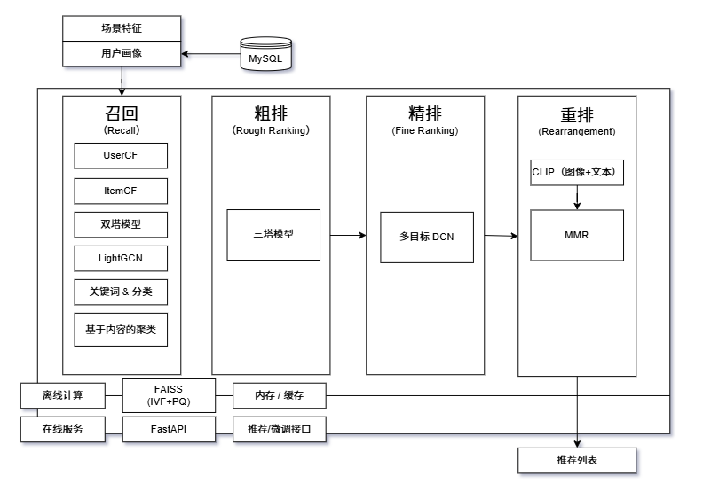

# Recommender System
本项目复现了工业界常用的有效的推荐系统各模块，并将其整合，外部封装良好，使用简便  
实现思路主要参考了王树森老师的b站视频，链接如下：https://www.bilibili.com/video/BV1HZ421U77y/?spm_id_from=333.1007.top_right_bar_window_history.content.click
## 🗂️ Architecture
本推荐系统的结构与工业界常用的结构相似，即大致分为4个模块：召回、粗排、精排、重排  
架构图如下

### Recall
召回的目的是尽可能的将用户可能喜欢的物品都纳入考虑范围内，这个范围可能会很大，在工业级系统中可能会从几亿物品中召回出几千个物品  
本系统的召回模块中主要有6个召回通道：基于用户的协同过滤UserCF、基于物品的协同过滤ItemCF、双塔模型召回、基于关键词和分类的召回、基于内容特征的聚类召回和基于LightGCN的召回  
其中基于关键词和分类的召回通道和基于内容特征的聚类召回通道用于解决物品冷启动问题
### Rough Ranking
粗排的目的是给召回出的几千个物品打分，这个粗排分数表示了当前用户喜欢这个物品的可能性，可能性越大，分数越高，最后根据这个分数排序，截断分数最高的前几百个物品送到下一个环节：精排  
因为粗排要处理的物品数仍然较多，因此打分模型不能太复杂，本系统的粗排模块使用的模型是三塔模型，这是一种介于双塔模型（后融合模型）和多目标排序模型（前融合模型）之间的模型，能够同时兼顾计算量和精度
### Fine Ranking
经过粗排的打分和截断，剩下的物品可认为都是用户比较感兴趣的物品了，而精排的目的是通过更复杂的模型进一步打分，更精准的刻画用户与物品之间的兴趣关系，该精排分数也会作为最后推荐结果的一个重要依据  
本系统的精排模块使用多目标DCN排序模型，网络比粗排模型更复杂，打出来的分也更精确  
注意：本系统中的精排模块只对物品打分，不做截断，从粗排模块传来的所有物品都会带着其精排分数进入下一个模块：重排
### Rearrangement
经过粗排和精排，我们已经对用户对物品的兴趣分数（即精排分数）做了详尽精确的刻画，而重排的目的是在最终的推荐结果中添加多样性，避免内容过于相近的内容出现在很小的一个区域  
以小红书的场景为例，重排的目的就是避免内容非常相近的内容出现在同一个页面，用户不能同时看到这些内容。工业界的实践中发现，添加多样性可以有效提升推荐系统的大盘指标  
本系统的重排模块主要利用MMR算法引入多样性，MMR算法中物品相似性的度量是通过提取两个物品的内容特征向量，再计算余弦相似度得到的。而物品的内容特征向量是通过分别提取物品的图文特征再进行concat得到的，这里用到的图片特征提取器和文字特征提取器来自于OpenAI团队做的一项著名工作：Clip，GitHub仓库链接如下：https://github.com/openai/CLIP
## 🏷️ Version
### v1.0
本推荐系统的第一个版本完成于2026.3.20，主要模块及用到的模型如下：  
召回：基于用户的协同过滤UserCF、基于物品的协同过滤ItemCF、双塔模型召回、基于关键词和分类的召回、基于内容特征的聚类召回  
粗排：三塔模型（其中的神经网络是简单的MLP）  
精排：多目标排序模型（其中的神经网络是简单的MLP，没有做特征交叉）  
重排：Clip的图片特征提取器和文字特征提取器，MMR算法
### v2.0
更新日期：2026.3.27，主要内容如下：  
1.添加基于LightGCN的图算法召回通道  
2.精排模型替换为多目标DCN深度交叉网络  
3.针对使用clip处理大数据量的场景做了一些计算内存优化
### v3.0
更新日期：2026.4.2，主要内容如下：  
1.优化离线计算环节  
主要利用了faiss向量数据库进行优化，双塔模型和LightGCN的物品特征向量在离线计算后插入faiss中（选择的索引是IVFxPQy），以便在在线推荐环节快速匹配相似度最高的TopK  
三塔模型的物品塔输出的物品特征向量也一样可以离线计算，但是因为还要取出来做前期融合，因此只能用内存或缓存进行存储，无法用faiss  
2.优化模型超参数  
在本次更新中，用超参数搜索方法寻找到了各个神经网络模型适合的超参数，所用数据集在/data文件夹中   
3.数据流  
到v3.0为止，工业级推荐系统所需的所有构件都已实现完毕，并具备部署能力，下面对目前推荐系统的**数据流**进行说明：  
(1) 从CSV文件中读取物品数据、用户数据、历史交互数据，得到三个Dataframe对象  
(2) 预处理Dataframe对象，得到用户画像和物品对象，同时构建推荐需要的字典等数据结构  
(3) 用准备好的数据初始化各推荐器，对于UserCF等非神经网络方法需要构建相似度矩阵等，而对于双塔模型等神经网络方法可直接载入预训练好的模型权重  
(4) 到这步可进行在线推荐，可认为推荐系统是一个端到端服务，输入用户ID、当前时间(小时)、当前是否是周末和当前是否是节假日四个信息，输出推荐的物品ID列表，列表中的顺序是有意义的，越靠前的推荐度越高并同时兼顾了多样性
### v4.0
更新日期：2026.4.10，本次更新主要针对工程落地问题，主要内容如下：  
1.基于FastAPI构建微服务  
基于FastAPI实现了推荐系统的对外接口(在interface/main.py中)，并部署在某IP下，经过**实测**，服务运行正常，响应速度良好  
注：因为工业级应用常使用数据库存储数据，本次更新中RecommenderSystem类针对数据库的数据流进行了一些调整，但基本逻辑不变，作为一个独立类放在了interface/recommender_system.py中  
2.支持基于数据库的离线-在线协同架构  
离线存储：应用启动时从数据库中读取推荐所需数据，将其转换为需要的Dataframe对象格式，然后做预处理，初始化各推荐器  
在线推荐：将推荐系统部署到某IP节点后可接受来自外部的推荐请求，返回推荐的物品ID列表  
**另**：模型的预训练权重和数据库的DDL语句已经分别上传到了/model_weights和/sql文件夹中
### v4.1
更新日期：2026.4.16，主要内容如下：  
1.支持根据新数据微调
在interface/main.py中添加了微调接口，该接口可根据调用方传来的起止时间划定“新数据”的范围，此后系统内部可自动调用数据库接口查询数据并进行模型微调  
2.补充异常处理  
对接口和Service层函数添加了异常处理和参数校验，提升系统鲁棒性
## 📊 Dataset
本项目所用的数据集只有一部分书籍信息是真实的，其他都是用AI工具生成的模拟的用户数据和交互记录，很大程度上只是为了模拟大数据量场景，进而做性能优化  
这样的数据集无法用于科研等严肃领域，也不涉及隐私问题
## ⚙️ Dependency
在运行本项目前，你需要配置合适的 Python 环境，你需要下载提供的environment.yml文件，然后在Anaconda prompt中运行：
>conda env create -f environment.yml

该命令会自动新建一个默认名称为 rs_project 的 conda 环境并导入所需的包，之后别忘了激活这个环境，运行：
>conda activate rs_project

最后一步需要单独安装GPU版本的Pytorch，运行：
>pip3 install torch torchvision --index-url https://download.pytorch.org/whl/cu126

安装完Pytorch后，还需要安装mmcv-full（需要先安装Pytorch才能编译），运行：
>pip install mmcv-full==1.7.2 -f https://download.openmmlab.com/mmcv/dist/cu126/torch2.6/index.html

注意：mmcv-full的安装链接需要根据你的CUDA版本和Pytorch版本调整，请参考 https://mmcv.readthedocs.io/en/master/get_started/installation.html 选择对应的版本
## 🚀 Usage
在使用/interface中的外部接口之前，你需要先做以下准备：  
>将main.py中的uvicorn.run函数参数修改为你自己的IP地址和端口号

>将database.py中的数据库连接url修改为你自己的用户名、密码、数据库服务器IP和数据库名称（如果你使用的不是MySQL，你需要更换驱动）  

修改后确定数据与我提供的csv文件或数据库格式一致（这样不容易出问题），之后运行/interface/main.py，推荐系统就会部署在你提供的IP和端口上，之后按照 [API](##API) 的要求发送请求即可
## 🔌 API
### POST /recommend
该接口基于用户ID及当前场景特征（如小时、是否周末、是否节假日）返回个性化推荐物品列表。适用于首页推荐、场景化推送等业务场景  

**请求参数Body**  

| 字段名        | 类型    | 必填 | 说明                     |
|---------------|---------|------|--------------------------|
| `user_id`     | string  | 是   | 用户唯一标识             |
| `hour`        | integer | 是   | 当前小时（0–23）         |
| `is_weekend`  | boolean | 是   | 是否为周末               |
| `is_holiday`  | boolean | 是   | 是否为节假日             |
  
**响应体（成功）**

| 字段名           | 类型            | 说明                         |
|------------------|-----------------|------------------------------|
| `status`         | string          | 状态，固定为 `"success"`     |
| `user_id`        | string          | 对应请求中的用户ID           |
| `recommendations`| array of string | 推荐的物品ID列表，顺序敏感   |
| `request_id`     | string (UUID)   | 本次请求的唯一标识，用于追踪 |
  
**响应体（失败）**

| HTTP 状态码 | 说明                             | 响应体示例                                                        |
|-------------|----------------------------------|--------------------------------------------------------------|
| `400`       | 请求参数缺失或格式错误           | `{"status": "error","message":"Missing request parameters"}` |
| `404`       | 用户不存在或无可用推荐模型       | `{"status": "error","message":"user doesn't exist"}`         |

### POST /fine_tuning
该接口基于调用方传来的起止时间，从数据库中查询到新数据，并用该数据进行推荐系统模型微调，返回的是微调成功与否的状态信息

**请求参数Body**  

| 字段名          | 类型       | 必填 | 说明   |
|--------------|----------|------|------|
| `start_time` | datetime | 是   | 起始时间 |
| `end_time`   | datetime | 是   | 终止时间 |
  
**响应体**

| 字段名               | 类型            | 说明                                |
|-------------------|-----------------|-----------------------------------|
| `status`          | string          | 微调是否成功的标识，成功为'success',失败为'error' |
| `message`         | string          | 对应于状态的补充信息                        |

## 📄 License

**Code:** The source code in this repository is licensed under the **MIT License**.  
**Weights:** The pre-trained model weights (in the `/model_weights` directory) are also licensed under the **MIT License**.

Copyright (c) 2026 ChendiLiu
